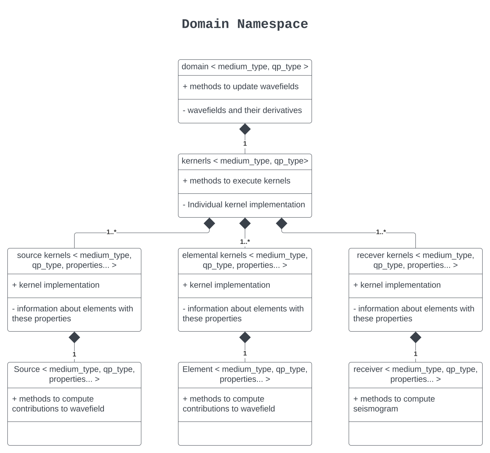

.. _domain_index_api_guide::

Domain
======

The domain is a templated class used to store wavefields and methods used to compute evolution of the wavefield in time. From a architectural standpoint, a domain consists of a set of elements, elemental sources and elemental receivers.

   Domain Namespace

.. toctree::
    :maxdepth: 1

    domain
    kernels/index
    element/elements
    receivers/receivers
    sources/sources
