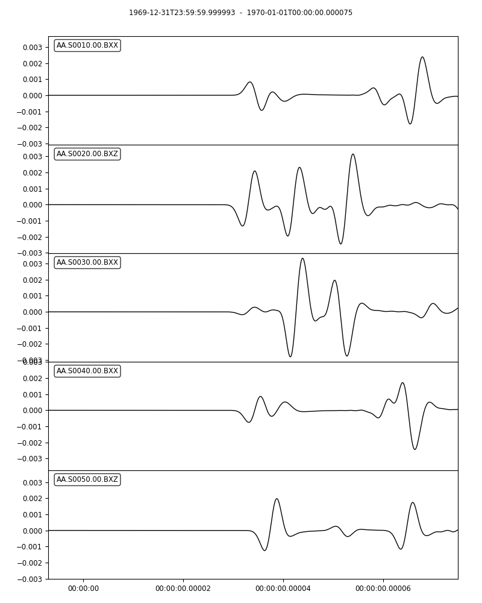
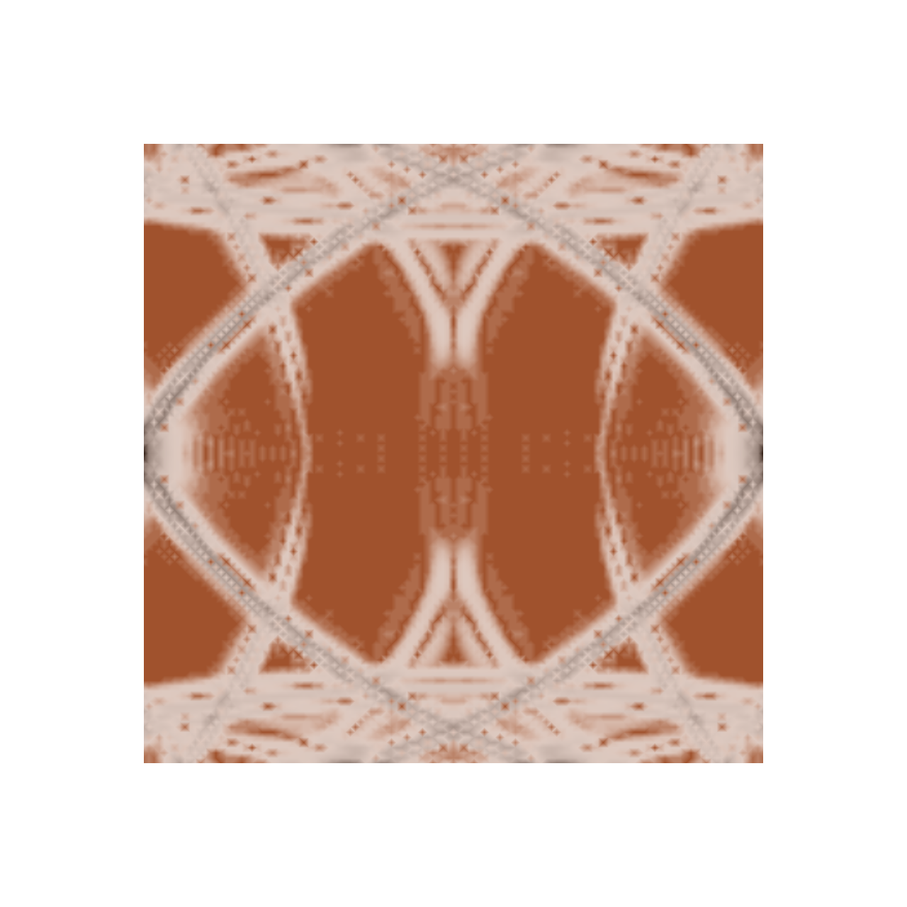

Wave propagration through anisotropic zinc crystal
==================================================

In this `example
<https://github.com/PrincetonUniversity/SPECFEMPP/tree/main/examples/anisotropic-crystal>`_
we simulate wave propagation through a 2-dimensional anistoropic zinc crystal.

Setting up the workspace
------------------------

Let's start by creating a workspace from where we can run this example.

.. code-block:: bash

    mkdir -p ~/specfempp-examples/anisotropic-crystal
    cd ~/specfempp-examples/anisotropic-crystal

We also need to check that the SPECFEM++ build directory is added to the ``PATH``.

.. code:: bash

    which specfem2d

If the above command returns a path to the ``specfem2d`` executable, then the
build directory is added to the ``PATH``. If not, you need to add the build
directory to the ``PATH`` using the following command.

.. code:: bash

    export PATH=$PATH:<PATH TO SPECFEM++ BUILD DIRECTORY/bin>

.. note::

    Make sure to replace ``<PATH TO SPECFEM++ BUILD DIRECTORY/bin>`` with the
    actual path to the SPECFEM++ build directory on your system.

Now let's create the necessary directories to store the input files and output
artifacts.

.. code:: bash

    mkdir -p OUTPUT_FILES
    mkdir -p OUTPUT_FILES/results

    touch specfem_config.yaml
    touch source.yaml
    touch topography_file.dat
    touch Par_File

Meshing the domain
------------------

Let's start by defining a mesh with anisotropic domains using the following
parameter file.

Parameter file
~~~~~~~~~~~~~~

.. literalinclude:: Par_file
    :caption: Par_file
    :language: bash
    :emphasize-lines: 59-73

Note the material string used to define an anisotropic velocity model.

.. literalinclude:: Par_file
    :language: bash
    :start-at: #   anisotropic:
    :end-at: #   anisotropic:
    :lineno-match:

The actual material is then numerically defined in the following line.

.. literalinclude:: Par_file
    :language: bash
    :start-at: 1 2
    :end-at: 1 2
    :lineno-match:

The material string generates an anisotopic medium with the following
properties

- Density :math:`rho = 7100.0 \mathrm{kg}/\mathrm{m}^3`
- :math:`C_{11} = 16.5 \cdot 10^{10} \mathrm{Pa}`
- :math:`C_{13} = 5.0 \cdot 10^{10} \mathrm{Pa}`
- :math:`C_{15} = 0.0 \mathrm{Pa}`
- :math:`C_{33} = 6.2 \cdot 10^{10} \mathrm{Pa}`
- :math:`C_{35} = 0.0 \mathrm{Pa}`
- :math:`C_{55} = 3.96 \cdot 10^{10} \mathrm{Pa}`
- :math:`C_{12} = 0.0 \mathrm{Pa}`
- :math:`C_{23} = 0.0 \mathrm{Pa}`
- :math:`C_{25} = 0.0 \mathrm{Pa}`

Defining the topography of the domain
~~~~~~~~~~~~~~~~~~~~~~~~~~~~~~~~~~~~~

Next, as in previous examples, we define the topography of the domain in the
``topography_file.dat`` file. This is very similar to :ref:`homogeneous_example`
with the main difference that this model is much smaller.

.. literalinclude:: topography_file.dat
    :caption: topography_file.dat
    :language: bash

Running ``xmeshfem2D``
~~~~~~~~~~~~~~~~~~~~~~

To execute the mesher run

.. code:: bash

    xmeshfem2D -p Par_File

Note the path of the database file and a stations file generated after successfully running the mesher.

Defining the source
~~~~~~~~~~~~~~~~~~~

We define the source location and the source time function in the source file.

.. literalinclude:: source.yaml
    :caption: source.yaml
    :language: yaml

Running the simulation
----------------------

To run the solver, we first need to define a configuration file
``specfem_config.yaml``.

.. literalinclude:: specfem_config.yaml
    :language: yaml
    :caption: specfem_config.yaml
    :emphasize-lines: 39-44

The solver file is familiar to the previous examples. However, we have added a
``display`` section to generate a wavefield snapshot at every 100th time step.

.. literalinclude:: specfem_config.yaml
    :language: yaml
    :caption: specfem_config.yaml
    :start-at: display:
    :end-at: time-interval: 100

Now we can run the solver using the following command.

.. code:: bash

    specfem2d -p specfem_config.yaml

Visualizing the traces and wavefield
------------------------------------

We can plot the traces stored in the ``OUTPUT_FILES/results`` directory using
the following python code.

.. literalinclude:: plot.py
    :language: python
    :caption: plot.py

   Traces.

   Wavefield snapshot at 1400th time-step.
