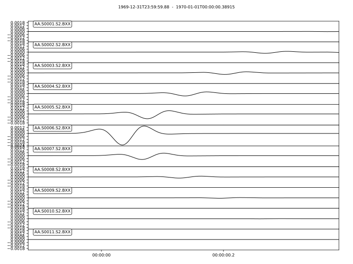
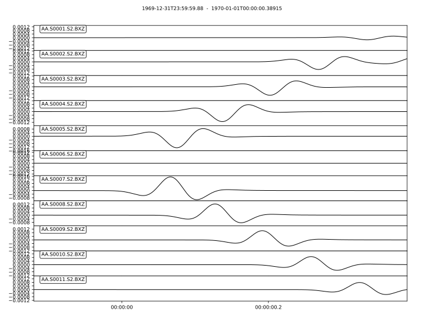

Wave propagration through fluid-solid interface
===============================================

This `example <https://github.com/PrincetonUniversity/SPECFEMPP/tree/main/examples/fluid-solid-interface>`_ simulates the fluid-solid example with flat ocean bottom from `Komatitsch et. al. <https://doi.org/10.1190/1.1444758>`_. This example demonstrates the use of the ``xmeshfem2D`` mesher to generate interface between 2 conforming material systems and the setting up absorbing boundary conditions.

Setting up the workspace
------------------------

Let's start by creating a workspace from where we can run this example.

.. code-block:: bash

    mkdir -p ~/specfempp-examples/fluid-solid-interface
    cd ~/specfempp-examples/fluid-solid-interface

We also need to check that the SPECFEM++ build directory is added to the ``PATH``.

.. code:: bash

    which specfem2d

If the above command returns a path to the ``specfem2d`` executable, then the build directory is added to the ``PATH``. If not, you need to add the build directory to the ``PATH`` using the following command.

.. code:: bash

    export PATH=$PATH:<PATH TO SPECFEM++ BUILD DIRECTORY/bin>

.. note::

    Make sure to replace ``<PATH TO SPECFEM++ BUILD DIRECTORY/bin>`` with the actual path to the SPECFEM++ build directory on your system.

Now let's create the necessary directories to store the input files and output artifacts.

.. code:: bash

    mkdir -p OUTPUT_FILES
    mkdir -p OUTPUT_FILES/seismograms

    touch specfem_config.yaml
    touch single_source.yaml
    touch topography_file.dat
    touch Par_File

Meshing the domain
------------------

We first start by generating a mesh for our simulation domain using
``xmeshfem2D``. To do this, we first define our simulation domain and the
meshing parmeters in a parameter file.

Parameter file
~~~~~~~~~~~~~~

.. literalinclude:: Par_File
    :language: bash
    :emphasize-lines: 65,72-73,113-119
    :caption: Par_File

- We define the acoustic and elastic velocity models in the `Velocity and
  density models` section of the parameter file.

  .. literalinclude:: Par_File
    :language: bash
    :lineno-match:
    :linenos:
    :start-at: nbmodels
    :end-at: nbmodels

  defines the number of material systems in the simulation domain. We then
  define the isotropic velocity model for each material system using the
  following format: ``model_number 1 rho Vp Vs 0 0 QKappa Qmu 0 0 0 0 0 0``.
  Such model 1 is

  .. literalinclude:: Par_File
      :language: bash
      :lineno-match:
      :linenos:
      :start-at: 1 1
      :end-at: 1 1

  and model 2 is

  .. literalinclude:: Par_File
      :language: bash
      :lineno-match:
      :linenos:
      :start-at: 2 1
      :end-at: 2 1

- We define stacey absorbing boundary conditions on all the edges of the domain
  using the ``STACEY_ABSORBING_CONDITIONS``, ``absorbbottom``, ``absorbright``,
  ``absorbtop`` and ``absorbleft`` parameters.

  .. literalinclude:: Par_File
      :language: bash
      :lineno-match:
      :linenos:
      :start-at: STACEY_ABSORBING_CONDITIONS
      :end-at: absorbleft

Defining the topography of the domain
~~~~~~~~~~~~~~~~~~~~~~~~~~~~~~~~~~~~~

We define the topography of the domain using the following topography file

.. literalinclude:: topography_file.dat
    :caption: topography_file.dat
    :language: bash

Running ``xmeshfem2D``
~~~~~~~~~~~~~~~~~~~~~~

To execute the mesher run

.. code:: bash

    xmeshfem2D -p Par_File

.. note::

    Make sure either your are in the build directory of SPECFEM2D kokkos or the
    ``../path/to/build/bin`` directory is added to your ``PATH``.

Note the path of the database file and a stations file generated after
successfully running the mesher.

Defining the source
~~~~~~~~~~~~~~~~~~~

We define the source location and the source time function in the source file.

.. literalinclude:: single_source.yaml
    :caption: single_source.yaml

Running the simulation
----------------------

To run the solver, we first need to define a configuration file ``specfem_config.yaml``.

.. literalinclude:: specfem_config.yaml
    :language: yaml
    :caption: specfem_config.yaml

With the configuration file in place, we can run the solver using the following command

.. code:: bash

    specfem2d -p specfem_config.yaml

Visualizing the results
-----------------------

The simulation generates seismograms at the stations defined in the
``specfem_config.yaml`` file. You can visualize the seismograms using the
following python script.

.. literalinclude:: plot.py
    :language: python
    :caption: plot.py

   X-component seismograms

    Z-component seismograms
