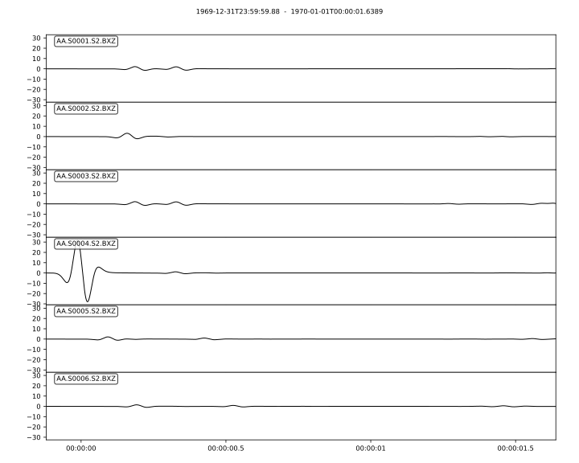

.. _homogeneous_example:

Wave propagration through homogeneous media
===========================================

In this `example <https://github.com/PrincetonUniversity/SPECFEMPP/tree/main/examples/homogeneous-medium-flat-topography>`_ we simulate wave propagation through a 2-dimensional homogeneous medium.

Setting up your workspace
--------------------------

Let's start by creating a workspace from where we can run this example.

.. code-block:: bash

    mkdir -p ~/specfempp-examples/homogeneous-medium-flat-topography
    cd ~/specfempp-examples/homogeneous-medium-flat-topography

We also need to check that the SPECFEM++ build directory is added to the
``PATH``.

.. code:: bash

    which specfem2d

If the above command returns a path to the ``specfem2d`` executable, then the
build directory is added to the ``PATH``. If not, you need to add the build
directory to the ``PATH`` using the following command.

.. code:: bash

    export PATH=$PATH:<PATH TO SPECFEM++ BUILD DIRECTORY/bin>

.. note::

    Make sure to replace ``<PATH TO SPECFEM++ BUILD DIRECTORY/bin>`` with the
    actual path to the SPECFEM++ build directory on your system.

Now let's create the necessary directories to store the input files and output
artifacts.

.. code:: bash

    mkdir -p OUTPUT_FILES
    mkdir -p OUTPUT_FILES/seismograms

    touch specfem_config.yaml
    touch single_source.yaml
    touch topography_file.dat
    touch Par_File

Generating a mesh
-----------------

To generate the mesh for the homogeneous media we need a parameter file,
``Par_File``, a topography file, `topography_file.dat`, and the mesher
executible, ``xmeshfem2D``, which should have been compiled during the
installation process.

.. note::
  Currently, we still use a mesher that was developed for the original `SPECFEM2D <https://specfem2d.readthedocs.io/en/latest/03_mesh_generation/>`_ code. More details on the meshing process can be found `here <https://specfem2d.readthedocs.io/en/latest/03_mesh_generation/>`_.

We first define the meshing parameters in a Parameter file.

Parameter File
~~~~~~~~~~~~~~~~

.. literalinclude:: Par_file
    :caption: Par_file
    :language: bash
    :emphasize-lines: 10-11,123-124

At this point, it is worthwhile to note few key parameters within the
``PAR_FILE`` as it pertains to SPECFEM++.

- This version of SPECFEM++ does not support simulations running across multiple
  nodes, i.e., we have not enabled MPI. Relevant parameter value:

.. literalinclude:: Par_File
    :language: bash
    :linenos:
    :start-at: NPROC
    :end-at: NPROC
    :lineno-match:

- The path to the topography file is provided using the ``interfacesfile``
  parameter. Relevant values:

.. literalinclude:: Par_File
    :language: bash
    :linenos:
    :start-at: interfacesfile
    :end-at: interfacesfile
    :lineno-match:

.. _homogeneous-medium-flat-topography-topography-file:

Topography file
~~~~~~~~~~~~~~~~~

.. literalinclude:: topography_file.dat
    :caption: topography_file.dat
    :language: bash
    :emphasize-lines: 11-13

The topography file defines the interfaces in the mesh using points the, first
number for interface 1 is the number of points on the interface, followed by the
x and z coordinates of each point. So in this case, we have two interfaces - the
bottom of the mesh and the topography. The bottom of the mesh is defined by two
points (0,0) and (5000,0) and the topography is defined by two points (0,3000)
and (5000,3000). The number of spectral elements in the vertical direction for
each layer is also defined in this file. In this case, we have 60 spectral
elements in the vertical direction. For a detailed description example with an
interface that has complex topography refer to the fluid-solid bathymetry
`example topography file here
<https://github.com/PrincetonUniversity/SPECFEMPP/blob/devel/examples/fluid-solid-bathymetry/topography_file.dat>`_.

Running ``xmeshfem2D``
~~~~~~~~~~~~~~~~~~~~~~

To execute the mesher run

.. code:: bash

    xmeshfem2D -p Par_File

Check the mesher generated files in the ``OUTPUT_FILES`` directory.

.. code:: bash

    ls -ltr OUTPUT_FILES

Defining sources
----------------

Next we define the sources using a YAML file. For full description on parameters
used to define sources refer :ref:`source_description`.

.. literalinclude:: single_source.yaml
    :caption: single_source.yaml
    :language: yaml
    :emphasize-lines: 4-5,10-13

In this file, we define a single source at the center of the domain.
The source is a force source with a source time function that is a Ricker
wavelet with a peak frequency of 10 Hz.

Configuring the solver
----------------------

Now that we have generated a mesh and defined the sources, we need to set up the
solver. To do this we define another YAML file ``specfem_config.yaml``. For full
description on parameters used to define sources refer
:ref:`parameter_documentation`.

.. literalinclude:: specfem_config.yaml
    :caption: specfem_config.yaml
    :language: yaml
    :emphasize-lines: 3-12,14-32,46-49

At this point lets focus on a few sections in this file:

- Configure the solver using ``simulation-setup`` section.

.. literalinclude:: specfem_config.yaml
    :caption: specfem_config.yaml
    :language: yaml
    :linenos:
    :start-at: simulation-setup
    :end-at: directory: OUTPUT_FILES/seismograms
    :lineno-match:

* We first define the integration quadrature to be used in the simulation. At
  this moment, the code supports a 4th order Gauss-Lobatto-Legendre quadrature
  with 5 GLL points (``GLL4``) & a 7th order Gauss-Lobatto-Legendre quadrature
  with 8 GLL points (``GLL7``).
* Define the solver scheme using the ``time-scheme`` parameter.
* Define the simulation mode to be forward and the output format for synthetic
  seismograms seismograms.

- Define the path to the meshfem generated database file using the
  ``mesh-database`` parameter and the path to source description file using
  ``sources`` parameter. Relevant parameter values:

.. literalinclude:: specfem_config.yaml
    :caption: specfem_config.yaml
    :language: yaml
    :linenos:
    :start-at: databases:
    :end-at: single_source.yaml
    :lineno-match:

- It is good practice to have distinct header section for you simulation. These
  sections will be printed to standard output during runtime helping the you to
  distinguish between runs using standard strings. Relevant paramter values

.. literalinclude:: specfem_config.yaml
    :caption: specfem_config.yaml
    :language: yaml
    :linenos:
    :start-at: header:
    :end-at: Boundary conditions
    :lineno-match:

Running the solver
-------------------

Finally, to run the SPECFEM++ solver

.. code:: bash

    specfem2d -p specfem_config.yaml

.. note::

    Make sure either your are in the build directory of SPECFEM++ or the build directory is added to your ``PATH``.

Visualizing seimograms
----------------------

Let us now plot the traces generated by the solver using ``obspy``. This version
of the code only supports ASCII output format for seismograms. To plot the
seismograms we need to read the ASCII files as ``numpy`` arrays and them convert
them to ``obspy`` streams. The following code snippet shows how to do this.

.. literalinclude:: plot_traces.py
    :language: python

   Traces for the Z component seismograms

   Traces for the Z component seismograms
