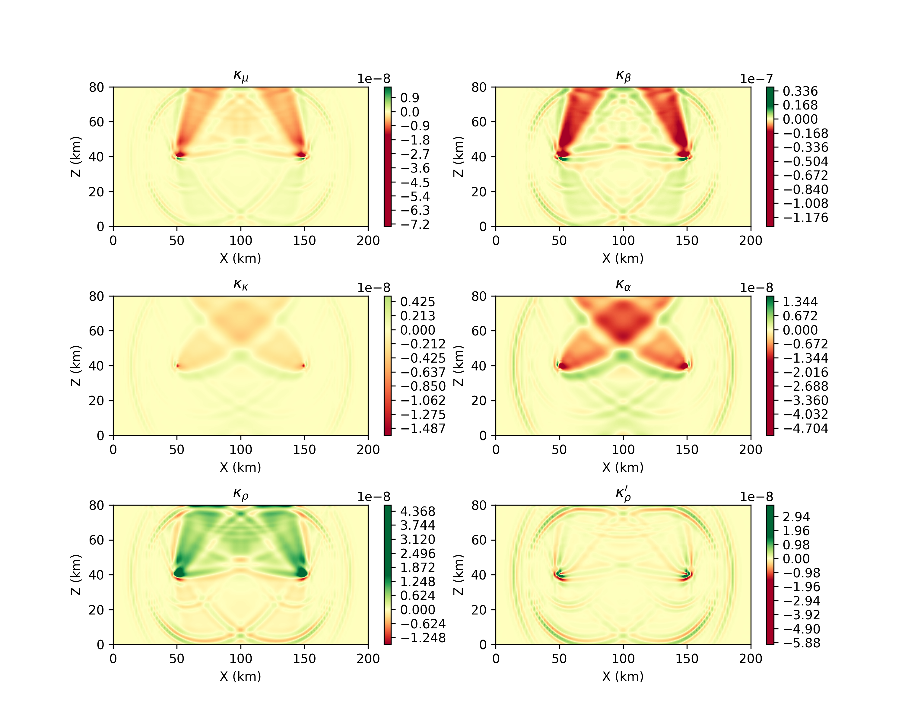

.. Tromp_Tape_Liu_2005::

Adjoint Simulations and Banana Donut Kernels
============================================

This `example <https://github.com/PrincetonUniversity/SPECFEMPP/tree/main/examples/Tromp_2005>`_ demonstrates how to setup forward and adjoint simulations to compute the banana donut kernels. We will reproduce the results from Fig 9 of `Tromp et al. 2005 <https://doi.org/10.1111/j.1365-246X.2004.02453.x>`_.

Setting up the forward simulation
---------------------------------

Lets start by setting up a forward simulation as we did in the previous notebooks. As before, we will need to generate a mesh where we define a velocity, and then run the forward simulation.

Setting up the Mesh
~~~~~~~~~~~~~~~~~~~

.. code-block:: bash
    :caption: PAR_FILE

    #-----------------------------------------------------------
    #
    # Simulation input parameters
    #
    #-----------------------------------------------------------
    # title of job
    title                           = Tromp_Tape_Liu_GJI_2005
    # parameters concerning partitioning
    NPROC                           = 1              # number of processes
    # Output folder to store mesh related files
    OUTPUT_FILES                   = <Location to store output artifacts>
    #-----------------------------------------------------------
    #
    # Mesh
    #
    #-----------------------------------------------------------
    # Partitioning algorithm for decompose_mesh
    PARTITIONING_TYPE               = 3              # SCOTCH = 3, ascending order (very bad idea) = 1
    # number of control nodes per element (4 or 9)
    NGNOD                           = 4
    # location to store the mesh
    database_filename               = <Output file to store the mesh generated>
    #-----------------------------------------------------------
    #
    # Receivers
    #
    #-----------------------------------------------------------
    # use an existing STATION file found in ./DATA or create a new one from the receiver positions below in this Par_file
    use_existing_STATIONS           = .false.

    # number of receiver sets (i.e. number of receiver lines to create below)
    nreceiversets                   = 1
    # orientation
    anglerec                        = 0.d0           # angle to rotate components at receivers
    rec_normal_to_surface           = .false.        # base anglerec normal to surface (external mesh and curve file needed)
    # first receiver set (repeat these 6 lines and adjust nreceiversets accordingly)
    nrec                            = 1              # number of receivers
    xdeb                            = 150000.        # first receiver x in meters
    zdeb                            = 40000.         # first receiver z in meters
    xfin                            = 70000.         # last receiver x in meters (ignored if only one receiver)
    zfin                            = 0.             # last receiver z in meters (ignored if only one receiver)
    record_at_surface_same_vertical = .false.        # receivers inside the medium or at the surface

    # filename to store stations file
    stations_filename              = <Location to stations file>

    #-----------------------------------------------------------
    #
    # Velocity and density models
    #
    #-----------------------------------------------------------

    # number of model materials
    nbmodels                        = 1
    # available material types (see user manual for more information)
    #   acoustic:              model_number 1 rho Vp 0  0 0 QKappa 9999 0 0 0 0 0 0 (for QKappa use 9999 to ignore it)
    #   elastic:               model_number 1 rho Vp Vs 0 0 QKappa Qmu  0 0 0 0 0 0 (for QKappa and Qmu use 9999 to ignore them)
    #   anisotropic:           model_number 2 rho c11 c13 c15 c33 c35 c55 c12 c23 c25   0 QKappa Qmu
    #   anisotropic in AXISYM: model_number 2 rho c11 c13 c15 c33 c35 c55 c12 c23 c25 c22 QKappa Qmu
    #   poroelastic:           model_number 3 rhos rhof phi c kxx kxz kzz Ks Kf Kfr etaf mufr Qmu
    #   tomo:                  model_number -1 0 0 A 0 0 0 0 0 0 0 0 0 0
    #
    # note: When viscoelasticity or viscoacousticity is turned on,
    #       the Vp and Vs values that are read here are the UNRELAXED ones i.e. the values at infinite frequency
    #       unless the READ_VELOCITIES_AT_f0 parameter above is set to true, in which case they are the values at frequency f0.
    #
    #       Please also note that Qmu is always equal to Qs, but Qkappa is in general not equal to Qp.
    #       To convert one to the other see doc/Qkappa_Qmu_versus_Qp_Qs_relationship_in_2D_plane_strain.pdf and
    #       utils/attenuation/conversion_from_Qkappa_Qmu_to_Qp_Qs_from_Dahlen_Tromp_959_960.f90.
    1 1 2600.d0 5800.d0 3198.6d0 0 0 10.d0 10.d0 0 0 0 0 0 0

    # external tomography file
    TOMOGRAPHY_FILE                 = ./DATA/tomo_file.xyz

    # use an external mesh created by an external meshing tool or use the internal mesher
    read_external_mesh              = .false.

    #-----------------------------------------------------------
    #
    # PARAMETERS FOR EXTERNAL MESHING
    #
    #-----------------------------------------------------------

    # data concerning mesh, when generated using third-party app (more info in README)
    # (see also absorbing_conditions above)
    mesh_file                       = ./DATA/mesh_file          # file containing the mesh
    nodes_coords_file               = ./DATA/nodes_coords_file  # file containing the nodes coordinates
    materials_file                  = ./DATA/materials_file     # file containing the material number for each element
    free_surface_file               = ./DATA/free_surface_file  # file containing the free surface
    axial_elements_file             = ./DATA/axial_elements_file   # file containing the axial elements if AXISYM is true
    absorbing_surface_file          = ./DATA/absorbing_surface_file   # file containing the absorbing surface
    acoustic_forcing_surface_file   = ./DATA/MSH/Surf_acforcing_Bottom_enforcing_mesh   # file containing the acoustic forcing surface
    absorbing_cpml_file             = ./DATA/absorbing_cpml_file   # file containing the CPML element numbers
    tangential_detection_curve_file = ./DATA/courbe_eros_nodes  # file containing the curve delimiting the velocity model

    #-----------------------------------------------------------
    #
    # PARAMETERS FOR INTERNAL MESHING
    #
    #-----------------------------------------------------------

    # file containing interfaces for internal mesh
    interfacesfile                  = <Location to topography file>

    # geometry of the model (origin lower-left corner = 0,0) and mesh description
    xmin                            = 0.d0           # abscissa of left side of the model
    xmax                            = 200000.d0      # abscissa of right side of the model
    nx                              = 80             # number of elements along X

    # absorbing boundary parameters (see absorbing_conditions above)
    absorbbottom                    = .true.
    absorbright                     = .false.
    absorbtop                       = .true.
    absorbleft                      = .true.

    # define the different regions of the model in the (nx,nz) spectral-element mesh
    nbregions                       = 1              # then set below the different regions and model number for each region
    # format of each line: nxmin nxmax nzmin nzmax material_number
    1 80  1 32 1

    #-----------------------------------------------------------
    #
    # DISPLAY PARAMETERS
    #
    #-----------------------------------------------------------

    # meshing output
    output_grid_Gnuplot             = .false.        # generate a GNUPLOT file containing the grid, and a script to plot it
    output_grid_ASCII               = .false.        # dump the grid in an ASCII text file consisting of a set of X,Y,Z points or not

.. code-block:: bash
    :caption: topography.dat

    # number of interfaces
    2
    #
    # for each interface below, we give the number of points and then x,z for each point
    #
    # interface number 1 (bottom of the mesh)
    2
    0 0
    200000 0
    # interface number 5 (topography, top of the mesh)
    2
    0 80000
    200000 80000
    #
    # for each layer, we give the number of spectral elements in the vertical direction
    #
    # layer number 1
    32

With the above input files, we can run the mesher to generate the mesh database.

.. code:: bash

    ./xmeshfem2D -p <PATH TO PAR_FILE>

Running the forward simulation
~~~~~~~~~~~~~~~~~~~~~~~~~~~~~~~

Now that we have the mesh database, we can run the forward simulation. Lets set up the runtime behaviour of the solver using the following input file.

.. code-block:: yaml
    :caption: specfem-config.yaml

    parameters:

        header:
            title: "Tromp-Tape-Liu (GJI 2005)"
            description: |
            Material systems : Elastic domain (1)
            Interfaces : None
            Sources : Force source (1)
            Boundary conditions : Free surface (1)
            Mesh : 2D Cartesian grid (1)
            Receiver : Displacement seismogram (1)
            Output : Wavefield at the last time step (1)
            Output : Seismograms in ASCII format (1)

        simulation-setup:
            quadrature:
                quadrature-type: GLL4

            solver:
                time-marching:
                    time-scheme:
                    type: Newmark
                    dt: 0.02
                    nstep: 3000
                    t0: 8.0

            simulation-mode:
                forward:
                    writer:
                        wavefield:
                            output-format: HDF5
                            output-folder: <output folder name>

                        seismogram:
                            output-format: ascii # output seismograms in HDF5 format
                            output-folder: <output folder name>

        receivers:
            stations-file: <Location to stations file>
            angle: 0.0
            seismogram-type:
                - displacement
            nstep_between_samples: 1

        run-setup:
            number-of-processors: 1
            number-of-runs: 1

        databases:
            mesh-database: <Location to mesh database>
            source-file: <Location to sources file>

There are several few critical parameters within the input file that we need to pay attention to:

1. Saving the forward wavefield: Computing frechet derivatives at time :math:`\tau` requires the adjoint wavefield at time :math:`\tau` and the forward wavefield at time :math:`T-\tau`. This would require saving the forward wavefield at every time step during the forward run. However, this can be memory intensive and slow down the simulation. To avoid this, we reconstruct the forward wavefield during the adjoint simulation. This is done by saving the wavefield at the last time step of the forward simulation and running the solver in reverse during the adjoint simulation. The combination of forward and adjoint simulations is called combined simulation within SPECFEM++.

To store the wavefield at the last time step, we need to set the following parameters in the input file:

.. code-block:: yaml

    writer:
        wavefield:
            output-format: HDF5
            output-folder: <output folder name>

2. Saving the synthetics: We need to save the synthetics at the receiver locations. It is import that we save the synthetics in ASCII format for displacement seismograms.

Lastly we define the source:

.. code-block:: yaml
    :caption: sources.yaml

      number-of-sources: 1
      sources:
        - force:
            x: 50000
            z: 40000
            source_surf: false
            angle: 270.0
            vx: 0.0
            vz: 0.0
            Ricker:
              factor: 0.75e+10
              tshift: 0.0
              f0: 0.42

With the above input files, we can run the forward simulation.

.. code:: bash

    ./specfem2d -p <specfem-config.yaml>

Generating adjoint sources
--------------------------

The next step is to generate the adjoint sources. We can generate the adjoint sources using ``./xadj_seismogram`` utility which models Eq. 45 of `Tromp et al. 2005 <https://doi.org/10.1111/j.1365-246X.2004.02453.x>`_. The utility requires synthetic seismograms and does not depend on the observed data.

.. code-block:: bash

    ./xadj_seismogram <window start time> <window end time> <station_name> <synthetics folder> <adjoint sources folder> <adjoint component>

Command line arguments:

1. ``window start time``: Start time of the window to compute the adjoint source.
2. ``window end time``: End time of the window to compute the adjoint source.
3. ``station_name``: Name of the station for which the adjoint source is to be computed.
4. ``synthetics folder``: Folder containing the synthetics.
5. ``adjoint sources folder``: Folder to store the adjoint sources.
6. ``adjoint component``: The adjoint component can be one of the following integers:

      - adjoint source given by X component ``adjoint-component = 1``
      - adjoint source given by Y component (SH waves) ``adjoint-component = 2``
      - adjoint source given by Z component ``adjoint-component = 3``
      - adjoint source given by X and Z components ``adjoint-component = 4``

For the current simulation we will use window start time = 27.0 and window end time = 32.0 and adjoint component = 1.

.. code:: bash

    ./xadj_seismogram 27.0 32.0 1 <Location to observed seismograms> <Location to synthetics> <Location to adjoint sources> 1

Running the adjoint simulation
------------------------------

Now finally we can run the adjoint simulation. We use the same mesh database as the forward run and the adjoint sources generated in the previous step. The input file for the adjoint simulation is similar to the forward simulation with the following changes:

1. The adjoint sources are added to the sources file. The adjoint sources require an external source time function generated during the previous step.

.. code-block:: yaml
    :caption: sources.yaml

    number-of-sources: 2
    sources:
         - force:
             x: 50000
             z: 40000
             source_surf: false
             angle: 270.0
             vx: 0.0
             vz: 0.0
             Ricker:
               factor: 0.75e+10
               tshift: 0.0
               f0: 0.42

        - adjoint-source:
            station_name: AA
            network_name: S0001
            x: 150000
            z: 40000
            source_surf: false
            angle: 0.0
            vx: 0.0
            vz: 0.0
            External:
              format: ascii
              stf-file: /scratch/gpfs/rk9481/specfem2d_kokkos/examples/Tromp_2005/OUTPUT_FILES/AA.S0001

1. To set up the a combined simulation, we need to replace the forward YAML node with a combined node.

.. code-block:: yaml
    :caption: combined YAML node

    combined:
        reader:
            wavefield:
                format: HDF5
                directory: <Directory containing the forward wavefield>

        writer:
            kernels:
                format: ASCII
                directory: <Directory to store the kernels>

With the above input files, we can run the adjoint simulation.

.. code:: bash

    ./specfem2d -p <specfem-config.yaml>

The kernels are stored in the directory specified in the input file. We can now plot the kernels to visualize the banana donut kernels.

Visualizing the kernels
------------------------

Lastly if the kernels are stored in ASCII format, we can use numpy to read the kernels and plot them.

    Kernels.
