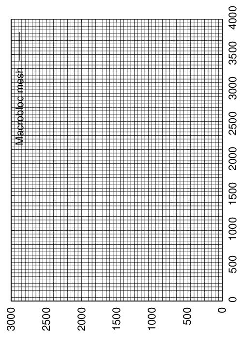

.. _Chapter1:

Chapter 1: Generating the mesh, sources and receivers
=====================================================

Before we start writing the solver, we need to generate an hexahedral mesh, and define our sources and receivers. To do this we will use the Fortran package ``MESHFEM2D``.

.. note::

    Since ``MESHFEM2D`` is a dependency for SPECFEM++, it is should already be installed as part of the SPECFEM++ installation.

Defining the MESHFEM2D Parameter File
-------------------------------------

Let us generate a Hex mesh for 2D elastic domain using the following parameter file. You will also need a topography file to define the surface topography of the mesh, see :ref:`Topgraphy File <homogeneous-medium-flat-topography-topography-file>`

.. note::

    More details on Parameter file can be found in :ref:`MESHFEM_Parameter_documentation`

.. code:: bash

    #-----------------------------------------------------------
    #
    # Simulation input parameters
    #
    #-----------------------------------------------------------

    # title of job
    title                           = Elastic Simulation with point source

    # parameters concerning partitioning
    NPROC                           = 1              # number of processes

    # Output folder to store mesh related files
    OUTPUT_FILES                   = /scratch/gpfs/rk9481/specfem2d_kokkos/examples/homogeneous-medium-flat-topography/OUTPUT_FILES

    #-----------------------------------------------------------
    #
    # Mesh
    #
    #-----------------------------------------------------------

    # Partitioning algorithm for decompose_mesh
    PARTITIONING_TYPE               = 3              # SCOTCH = 3, ascending order (very bad idea) = 1

    # number of control nodes per element (4 or 9)
    NGNOD                           = 9

    # location to store the mesh
    database_filename               = /scratch/gpfs/rk9481/specfem2d_kokkos/examples/homogeneous-medium-flat-topography/OUTPUT_FILES/database.bin

    #-----------------------------------------------------------
    #
    # Receivers
    #
    #-----------------------------------------------------------

    # use an existing STATION file found in ./DATA or create a new one from the receiver positions below in this Par_file
    use_existing_STATIONS           = .false.

    # number of receiver sets (i.e. number of receiver lines to create below)
    nreceiversets                   = 2

    # orientation
    anglerec                        = 0.d0           # angle to rotate components at receivers
    rec_normal_to_surface           = .false.        # base anglerec normal to surface (external mesh and curve file needed)

    # first receiver set (repeat these 6 lines and adjust nreceiversets accordingly)
    nrec                            = 3             # number of receivers
    xdeb                            = 2200.           # first receiver x in meters
    zdeb                            = 2200.          # first receiver z in meters
    xfin                            = 2800.          # last receiver x in meters (ignored if only one receiver)
    zfin                            = 2200.          # last receiver z in meters (ignored if only one receiver)
    record_at_surface_same_vertical = .true.         # receivers inside the medium or at the surface (z values are ignored if this is set to true, they are replaced with the topography height)

    # second receiver set
    nrec                            = 3             # number of receivers
    xdeb                            = 2500.          # first receiver x in meters
    zdeb                            = 2500.          # first receiver z in meters
    xfin                            = 2500.          # last receiver x in meters (ignored if only one receiver)
    zfin                            = 1900.             # last receiver z in meters (ignored if only one receiver)
    record_at_surface_same_vertical = .false.        # receivers inside the medium or at the surface (z values are ignored if this is set to true, they are replaced with the topography height)

    # filename to store stations file
    stations_filename              = /scratch/gpfs/rk9481/specfem2d_kokkos/examples/homogeneous-medium-flat-topography/OUTPUT_FILES/STATIONS

    #-----------------------------------------------------------
    #
    # Velocity and density models
    #
    #-----------------------------------------------------------

    # number of model materials
    nbmodels                        = 1
    1 1 2700.d0 3000.d0 1732.051d0 0 0 9999 9999 0 0 0 0 0 0

    # external tomography file
    TOMOGRAPHY_FILE                 = ./DATA/tomo_file.xyz

    # use an external mesh created by an external meshing tool or use the internal mesher
    read_external_mesh              = .false.

    #-----------------------------------------------------------
    #
    # PARAMETERS FOR EXTERNAL MESHING
    #
    #-----------------------------------------------------------

    # data concerning mesh, when generated using third-party app (more info in README)
    # (see also absorbing_conditions above)
    mesh_file                       = ./DATA/mesh_file          # file containing the mesh
    nodes_coords_file               = ./DATA/nodes_coords_file  # file containing the nodes coordinates
    materials_file                  = ./DATA/materials_file     # file containing the material number for each element
    free_surface_file               = ./DATA/free_surface_file  # file containing the free surface
    axial_elements_file             = ./DATA/axial_elements_file   # file containing the axial elements if AXISYM is true
    absorbing_surface_file          = ./DATA/absorbing_surface_file   # file containing the absorbing surface
    acoustic_forcing_surface_file   = ./DATA/MSH/Surf_acforcing_Bottom_enforcing_mesh   # file containing the acoustic forcing surface
    absorbing_cpml_file             = ./DATA/absorbing_cpml_file   # file containing the CPML element numbers
    tangential_detection_curve_file = ./DATA/courbe_eros_nodes  # file containing the curve delimiting the velocity model

    #-----------------------------------------------------------
    #
    # PARAMETERS FOR INTERNAL MESHING
    #
    #-----------------------------------------------------------

    # file containing interfaces for internal mesh
    interfacesfile                  = /scratch/gpfs/rk9481/specfem2d_kokkos/examples/homogeneous-medium-flat-topography/topography.dat

    # geometry of the model (origin lower-left corner = 0,0) and mesh description
    xmin                            = 0.d0           # abscissa of left side of the model
    xmax                            = 4000.d0        # abscissa of right side of the model
    nx                              = 80             # number of elements along X

    STACEY_ABSORBING_CONDITIONS     = .false.

    # absorbing boundary parameters (see absorbing_conditions above)
    absorbbottom                    = .false.
    absorbright                     = .false.
    absorbtop                       = .false.
    absorbleft                      = .false.

    # define the different regions of the model in the (nx,nz) spectral-element mesh
    nbregions                       = 1              # then set below the different regions and model number for each region
    # format of each line: nxmin nxmax nzmin nzmax material_number
    1 80  1 60 1

    #-----------------------------------------------------------
    #
    # DISPLAY PARAMETERS
    #
    #-----------------------------------------------------------

    # meshing output
    output_grid_Gnuplot             = .true.        # generate a GNUPLOT file containing the grid, and a script to plot it
    output_grid_ASCII               = .false.        # dump the grid in an ASCII text file consisting of a set of X,Y,Z points or not

Running the mesher
------------------

With the parameter file defined, we can now run the mesher to generate mesh and the receiver locations -

.. code:: bash

    ./build/xmeshfem2D -p Par_file

Defining sources
----------------

Now that we have the mesh and receiver locations, we can define the sources. We will use the following source file to define the sources.

.. code:: yaml
    :caption: sources.yaml

    number-of-sources: 1
    sources:
      - force:
          x : 2500.0
          z : 2500.0
          source_surf: false
          angle : 0.0
          vx : 0.0
          vz : 0.0
          Ricker:
            factor: 1e10
            tshift: 0.0
            f0: 10.0

Final mesh
----------

