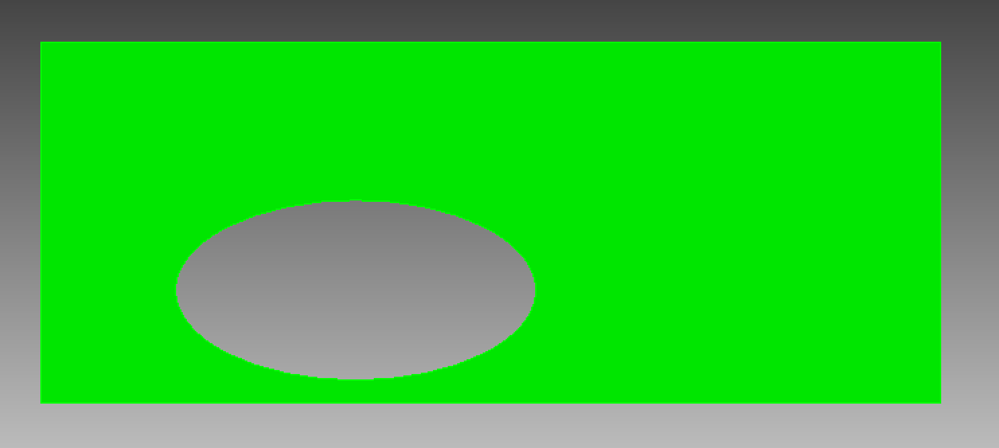
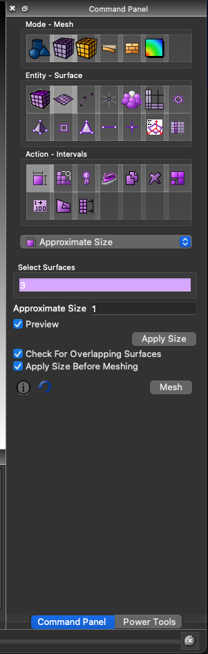
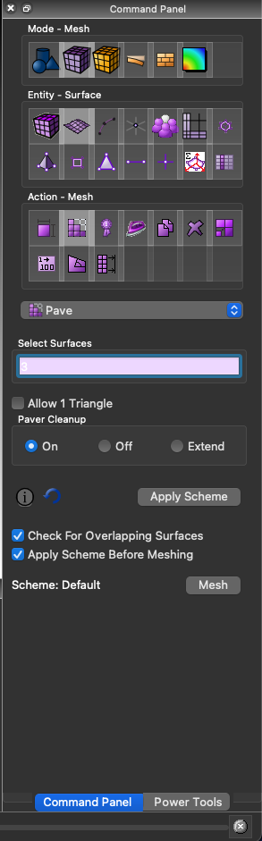
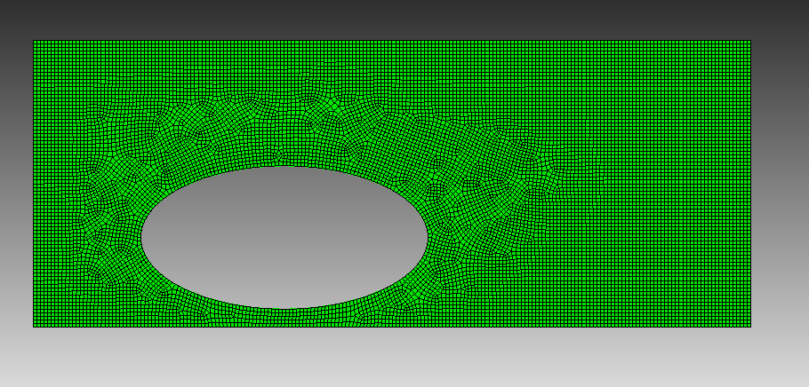

.. _docs_sections_cookbooks_dim2_CUBIT:

Running SPECFEM++ using a CUBIT mesh
====================================

As with any finite element solver, SPECFEM++ solver requires a mesh generation step to discritize the domain. In particular, our spectral element solver requires an hexahedral mesh, and does not support tetrahedral meshes. Up until now, all previous examples use the internal mesher to mesh simple domains - particularly domains with layered sandwitch structures. However, for more complex domains, we need to use an external mesher. In this example, we will use CUBIT to generate a mesh for a simple 2D rectangular domain with an ellipsoidal cavity.

.. note::

    Please note that this is not inteded to be an in-depth tutorial on meshing using CUBIT. The goal of this cookbook is to demonstrate how to define the mesh so that SPECFEM++ solver is able to read it. For more information on meshing using CUBIT, please refer to the `CUBIT tutorials <https://cubit.sandia.gov/tutorials>`_.`

Creating the domain
-------------------

Let's start by creating the domain using CUBIT in 5 steps:

1. Create a rectangular domain with dimensions 200m x 80m
2. Move the origin to the corner of the rectangle
3. Create an ellipsoidal cavity with semi-major and semi-minor axes of 40m and 20m respectively
4. Move the ellipse by (70m, 25m)
5. Subtract the ellipse from the rectangle to create a cavity

The following script performs the above steps in CUBIT. You can copy and paste this script into the CUBIT command line interface to create the domain.

.. code-block:: bash
    :caption: cubit_script.jou

    create surface rectangle width 200 height 80 yplane
    move Surface 1 x 100 y 0 z 40 include_merged
    create surface ellipse major radius 40 minor radius 20 yplane
    move Surface 2 x 70 y 0 z 25 include_merged
    subtract surface 2 from surface 1

At this point, you'll notice that your view point is not along the correct axis. You can fix this by changing the view plane within the display drop-down menu.

.. note::

    Please note that you can also create the domain interactively using the CUBIT GUI. Specifically the geometry tab within the command panel.

Meshing the domain
------------------

Let us now mesh the domain interactively using the CUBIT GUI.

|mesh_size| |mesh_gen|

- Step 1: Set the mesh size. Here we are setting the approximate size setting to 1, and `select_surfaces` to 3.  Make sure to click apply size bottom after setting the size.

- Step 2: Generate the mesh. Set the `select_surfaces` to 3. Click the mesh button after selecting the pave setting.

The final mesh should look similar to the one below. You should have ~13500 elements within the mesh.

Generating blocks to be read by SPECFEM++
-----------------------------------------

Blocks within CUBIT are a collection of mesh elements that have common properties. For the mesh we are generating we need to generate 5 blocks.

- Block 1: A material block for the solid medium which contains all elements within the mesh.

.. code-block:: bash
    :caption: material_block_1.jou

    block 1 face in surf 3
    block 1 name 'Granit'
    block 1 element type QUAD4
    block 1 attribute count 1 ## This attribute defines the material from the par file associated with this block

.. note::

    It is important that we create the material block with a face attribute. This is used as a reference to identify the block within the export script we'll use later.

- Block 2: An absorbing boundary block for the bottom boundary

.. code-block:: bash
    :caption: absorbing_block_2.jou

    block 2 edge in curve 1
    block 2 name 'abs_bottom'
    block 2 element type BAR2

- Block 3: An absorbing boundary block for the left boundary

.. code-block:: bash
    :caption: absorbing_block_3.jou

    block 3 edge in curve 2
    block 3 name 'abs_left'
    block 3 element type BAR2

- Block 4: An absorbing boundary block for the top boundary

.. code-block:: bash
    :caption: absorbing_block_3.jou

    block 4 edge in curve 3
    block 4 name 'abs_top'
    block 4 element type BAR2

- Block 5: An absorbing boundary block for the right boundary

.. code-block:: bash
    :caption: absorbing_block_5.jou

    block 5 edge in curve 4
    block 5 name 'abs_right'
    block 5 element type BAR2

Exporting the mesh
------------------

Exporting the mesh requires running a python script that is available within the SPECFEM++ repository. You can find the script at ``<PATH TO SPECFEM++ DIRECTORY>/scripts/CUBIT/export_cubit.py``.

.. code-block:: bash
    :caption: import_script.jou

    play "<PATH TO SPECFEM++ DIRECTORY>/scripts/CUBIT/export_cubit.py"

Make sure to replace ``<PATH TO SPECFEM++ DIRECTORY>`` with the actual path to the SPECFEM++ directory on your system. Next we need to switch to a directory where we want to export the mesh. To do set the working directory to ``<PATH TO WORKING DIRECTORY>`` using file drop-down menu within the command panel.

Finally, we can export the mesh using the ``export2SPECFEM2D`` python function defined in the above python script.

.. note::

    Make sure to switch to python tab within the command line panel.

.. code-block:: python
    :caption: export_script.jou

    export2SPECFEM2D()

This should generate the following files within the working directory.

- ``mesh_file`` - File containing the connectivity of the mesh
- ``nodes_coord_file`` - File containing the coordinates of the mesh nodes
- ``free_surface_file`` - File containing the nodes on the free surface
- ``absorbing_surface_file`` - File containing the nodes on the absorbing boundaries
- ``material_file`` - File containing the material properties for each element

Running the Mesher
------------------

Now let's define the meshing parameters in a parameter file, and run the mesher to generate the database.

.. literalinclude:: Par_file
    :language: bash
    :emphasize-lines: 83,93-101
    :caption: Par_file

- We now define the CUBIT generated files in the following lines

.. literalinclude:: Par_file
    :language: bash
    :lines: 83,93-101

We can now run the mesher using the following command.

.. code-block:: bash

    xmeshfem2D -p Par_file

Running the solver
------------------

As we did in all previous examples, we need to now define the sources and simulation parameters in the following files.

- ``sources.yaml`` - File containing the source parameters

.. literalinclude:: sources.yaml
    :language: yaml
    :caption: sources.yaml

- ``specfem_config.yaml`` - File containing the simulation parameters

.. literalinclude:: specfem_config.yaml
    :language: yaml
    :caption: specfem_config.yaml

Finally, we can run the solver using the following command.

.. code-block:: bash

    specfem2D -p specfem_config.yaml

[Optional] Visualizing the wavefield
------------------------------------

To create an animated gif of the wavefield evolution, you can use ImageMagick (if available):

.. code:: bash
    magick OUTPUT_FILES/display/wavefield*.png -trim +repage -delay 10 -loop 0 wavefield.gif

The output animated gif will show the wavefield evolution over time. We can see that the P-wave is impinging on the cavity diffracting/reflecting along the edge, and a little later the S-wave doing the same with the addition of S-to-P reflections.

.. image:: wavefield.gif
    :width: 100%
    :alt: Animated wavefield evolution
