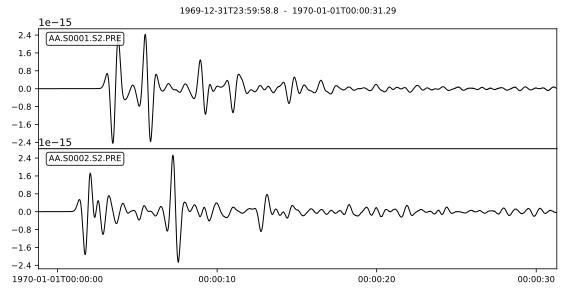
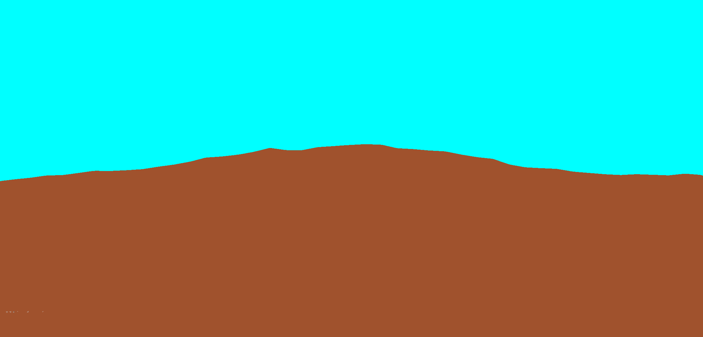

Wave propagation through fluid-solid interface with bathymetry
==============================================================

This `example
<https://github.com/PrincetonUniversity/SPECFEMPP/tree/main/examples/fluid-solid-bathymetry>`_
simulates wave propagation in a tele-seismic plane wave scenario within a
fluid-solid domain with complex bathymetry. This example demonstrates the use of
the ``xmeshfem2D`` mesher to generate interface between 2 conforming material
systems with realistic seafloor topography and the setting up absorbing boundary
conditions. This example is contributed by Sirawich Pipatprathanporn and is part
of the publication `Pipatprathanporn et al.
(2024) <https://doi.org/10.1093/gji/ggae238>`_.

Setting up the workspace
------------------------

Let's start by creating a workspace from where we can run this example.

.. code-block:: bash

    mkdir -p ~/specfempp-examples/fluid-solid-bathymetry
    cd ~/specfempp-examples/fluid-solid-bathymetry

We also need to check that the SPECFEM++ executable directory is added to the
``PATH``.

.. code:: bash

    which specfem2d

If the above command returns a path to the ``specfem2d`` executable, then the
executable directory is added to the ``PATH``. If not, you need to add the
executable directory to the ``PATH`` using the following command.

.. code:: bash

    export PATH=$PATH:<PATH TO SPECFEM++ DIRECTORY/bin>

.. note::

    Make sure to replace ``<PATH TO SPECFEM++ DIRECTORY/bin>`` with the actual
    path to the SPECFEM++ directory on your system.

Now let's create the necessary directories to store the input files and output
artifacts.

.. code:: bash

    mkdir -p OUTPUT_FILES
    mkdir -p OUTPUT_FILES/seismograms
    mkdir -p OUTPUT_FILES/results
    mkdir -p OUTPUT_FILES/display

    touch specfem_config.yaml
    touch line_source.yaml
    touch topography_file.dat
    touch Par_file

Meshing the domain
------------------

We first start by generating a mesh for our simulation domain using
``xmeshfem2D``. To do this, we first define our simulation domain and the
meshing parameters in a parameter file.

Parameter file
~~~~~~~~~~~~~~

.. literalinclude:: Par_file
    :language: bash
    :emphasize-lines: 74,81-82,122-128
    :caption: Par_file

Key features of this parameter file:

- **Line 74**: Defines 2 material systems (``nbmodels = 2``)
- **Lines 81-82**: Material definitions for elastic (2500 kg/m³, Vp=3400 m/s, Vs=1963 m/s) and acoustic (1020 kg/m³, Vp=1500 m/s) domains
- **Lines 122-128**: Stacey absorbing boundary conditions on bottom, right, and left edges, with free surface on top
- **Line 115**: References the topography file for complex bathymetry interface

Defining the bathymetry
~~~~~~~~~~~~~~~~~~~~~~~

The bathymetry is a critical component of this simulation as it defines the
complex seafloor interface between the acoustic (water) and elastic (solid)
domains. The topography file uses SPECFEM2D's internal meshing format to
describe three interfaces and their mesh discretization.

Topography file structure
^^^^^^^^^^^^^^^^^^^^^^^^^

.. literalinclude:: topography_file.dat
    :caption: topography_file.dat
    :language: bash

The topography file defines three interfaces:

1. **Interface 1 (bottom boundary)**: A simple horizontal line at z=0 defining the
   bottom of the computational domain:

   - 2 points: (0,0) and (20000,0)
   - Serves as the bottom absorbing boundary

2. **Interface 2 (seafloor bathymetry)**: The complex seafloor topography with
   501 points spanning from x=0 to x=20000 meters:

   - Points are spaced every 40 meters horizontally
   - Depth varies from ~4441m to ~4653m, creating realistic seafloor relief
   - This interface separates the elastic solid (below) from acoustic fluid (above)
   - The bathymetry shows gradual depth variations typical of abyssal seafloor

3. **Interface 3 (free surface)**: A flat horizontal surface at z=9600m representing
   the ocean surface:

   - 2 points: (0,9600) and (20000,9600)
   - Acts as the free surface boundary for acoustic waves

**Layer discretization**: The file also specifies the number of spectral elements
in each layer:

- Layer 1 (seafloor to bottom): 62 elements vertically
- Layer 2 (seafloor to surface): 58 elements vertically

This creates a mesh where the acoustic domain (water) sits above the complex
bathymetry, and the elastic domain (solid earth) lies below it. The varying
seafloor depth creates realistic wave scattering and conversion effects at the
fluid-solid interface.

Running ``xmeshfem2D``
~~~~~~~~~~~~~~~~~~~~~~

To execute the mesher run:

.. code:: bash

    xmeshfem2D -p Par_file

.. note::

    Make sure either you are in the build directory of SPECFEM2D kokkos or the
    ``../path/to/specfempp/bin`` directory is added to your ``PATH``.

Note the path of the database file and a stations file generated after
successfully running the mesher.

Running the solver
------------------

After successfully meshing the domain, we can now define the source and run the
solver.

Defining the source
~~~~~~~~~~~~~~~~~~~

This example simulates a tele-seismic plane wave by creating a distributed source
system using 234 moment-tensor sources. This technique, developed by Pipatprathanporn
et al. (2024), allows for realistic simulation of distant earthquake waves as they
would appear at the seafloor. The methodology is based on the approach described
in the `MERMAID waveform repository <https://github.com/sirpipat/MERMAID_waveform/blob/main/specfem2d_input_setup.m>`_.

Line source methodology
^^^^^^^^^^^^^^^^^^^^^^^

The plane wave is created by distributing sources in both horizontal and vertical
arrays, with carefully calculated timing and amplitudes:

**Horizontal source array (197 sources)**:
- Located at depth z=720m in the elastic domain
- Spaced every 100m horizontally from x=200m to x=19800m
- Time shifts increment by 5.309 ms between adjacent sources
- Moment tensor factor: 9.836e-10

**Vertical source array (37 sources)**:
- Located at x=200m in the elastic domain
- Spaced every 100m vertically from z=820m to z=4420m
- Time shifts calculated to maintain plane wave coherence
- Moment tensor factor: 1.805e-10 (scaled for vertical component)

Source generation algorithm
^^^^^^^^^^^^^^^^^^^^^^^^^^^

The line source is designed to simulate a plane wave by distributing multiple
moment tensor sources with carefully calculated time delays. The methodology is
based on wave propagation physics and follows the implementation in the
`SPECFEM++ Python utilities <https://github.com/PrincetonUniversity/specfempp-py/blob/main/src/specfempp/examples_utilities/sources.py>`_
and `MERMAID waveform setup <https://github.com/sirpipat/MERMAID_waveform/blob/main/specfem2d_input_setup.m>`_.

**Physical basis for time delay calculation**:

The time shifts are computed from the wave propagation geometry:

.. code-block:: python
   :caption: Physics-based time delay calculation

   import numpy as np

   # Physical parameters (derived from actual implementation)
   angle = 10.4      # Effective incidence angle in degrees
   vp = 3400.0       # P-wave velocity in m/s
   dx = 100.0        # Horizontal source spacing in m
   dz = 100.0        # Vertical source spacing in m

   # Horizontal source array (197 sources)
   for i in range(197):
       x_pos = 200 + i * dx
       z_pos = 720
       # Time delay: tshift = i * 5309e-6 seconds
       tshift = i * dx * np.sin(angle * np.pi / 180) / vp
       # Result: tshift ≈ i * 5.309e-3 seconds

   # Vertical source array (37 sources)
   for i in range(37):
       x_pos = 200
       z_pos = 820 + i * dz
       # Time delay: tshift = i * 28930e-6 seconds
       tshift = i * dz * np.cos(angle * np.pi / 180) / vp
       # Result: tshift ≈ i * 28.9e-3 seconds

**Mathematical derivation**:

Starting from the physical parameters of a tele-seismic plane wave, we can compute
the required time delays to create coherent wave propagation.

**Given parameters**:

- Incidence angle: θ = 10.4° (typical for regional/tele-seismic arrivals)
- P-wave velocity in elastic domain: Vp = 3400 m/s
- Source spacing: Δx = Δz = 100 m

**Horizontal array time delays**:

For sources distributed horizontally, the time delay accounts for the horizontal
component of wave propagation:

.. math::

   \Delta t_{horizontal} = \frac{\Delta x \sin \theta}{V_p} = \frac{100 \times \sin(10.4°)}{3400}

   \sin(10.4°) = 0.1805

   \Delta t_{horizontal} = \frac{100 \times 0.1805}{3400} = 0.005309 \text{ s} = 5309 \text{ μs}

Therefore: **tshift = i × 5309 μs** for horizontal sources.

**Vertical array time delays**:

For sources distributed vertically, the time delay accounts for the vertical
component of wave propagation:

.. math::

   \Delta t_{vertical} = \frac{\Delta z \cos \theta}{V_p} = \frac{100 \times \cos(10.4°)}{3400}

   \cos(10.4°) = 0.9816

   \Delta t_{vertical} = \frac{100 \times 0.9816}{3400} = 0.02887 \text{ s} = 28870 \text{ μs}

The implementation uses 28930 μs, which closely matches our calculation.

Therefore: **tshift = i × 28930 μs** for vertical sources.

**Final implementation values**:
- **Horizontal sources**: tshift = i × 5309 μs
- **Vertical sources**: tshift = i × 28930 μs

**Wave propagation geometry**:

The time delays ensure that all sources contribute constructively to form a
coherent plane wave. The horizontal delays account for the projection of the
wave vector onto the x-axis (sin θ), while vertical delays account for the
z-component (cos θ). This creates a wavefront that propagates at the specified
incidence angle through both the elastic solid and acoustic fluid domains.

.. literalinclude:: line_source.yaml
    :caption: line_source.yaml
    :language: yaml

Physical interpretation
^^^^^^^^^^^^^^^^^^^^^^^

This distributed source approach simulates how tele-seismic waves from distant
earthquakes appear as approximately planar wavefronts when they reach the seafloor.
The method allows for:

- **Realistic wavefront geometry**: Maintains proper phase relationships across the domain
- **Proper energy distribution**: Sources are scaled to represent appropriate amplitudes
- **Computational efficiency**: Uses existing moment-tensor source infrastructure
- **Flexible incident angles**: Time delays can be adjusted for different wave arrival angles

This technique is particularly valuable for studying how seismic waves interact
with complex seafloor bathymetry, as it provides a controlled yet realistic
source mechanism for marine seismology applications.

Running the simulation
~~~~~~~~~~~~~~~~~~~~~~

To run the solver, we first need to define a configuration file ``specfem_config.yaml``.

.. literalinclude:: specfem_config.yaml
    :language: yaml
    :caption: specfem_config.yaml

Key configuration features:
- Forward simulation using Newmark time scheme
- Time step dt = 1.0e-3 s with 32,500 time steps
- Wavefield snapshots saved every 500 time steps for visualization
- Seismograms recorded at two receiver locations
- Pressure recordings for the acoustic domain

With the configuration file in place, we can run the solver using the following command:

.. code:: bash

    specfem2d -p specfem_config.yaml

[Optional] Visualizing the results
----------------------------------

The simulation generates seismograms at the stations defined in the
``specfem_config.yaml`` file and wavefield snapshots for visualization.
You can visualize the seismograms using the following python script.

.. literalinclude:: plot.py
    :language: python
    :caption: plot.py

The output image is should look like this:

[Optional] Creating animated visualization
------------------------------------------

To create an animated gif of the wavefield evolution, you can use ImageMagick
(if available):

.. code:: bash

    # Create directory for cropped images
    mkdir output_cropped

    # Crop images to remove white borders
    for file in $(ls OUTPUT_FILES/display/wavefield*.png); do
        bname=$(basename $file)
        magick $file -crop 2260x1110+150+725 output_cropped/$bname
    done

    # Create animated gif
    magick convert -coalesce -delay 1 -loop 0 output_cropped/wavefield*.png fluid-solid-bathymetry.gif

The output animated gif will show the wavefield evolution over time, illustrating
the interaction of seismic waves with the complex bathymetry and fluid-solid
interfaces. The animation captures how the waves propagate through the acoustic
and elastic domains, reflecting and refracting at the seafloor interface.

This example demonstrates how SPECFEM++ can handle complex bathymetry and
fluid-solid interfaces, making it suitable for seismic wave propagation studies
in marine environments.
