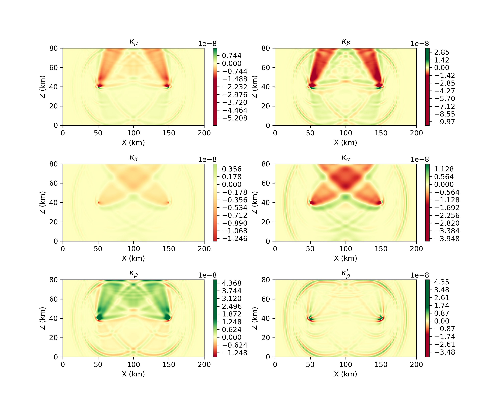

.. _Tromp_Tape_Liu_2005:

Adjoint Simulations and Banana Donut Kernels
============================================

This `example
<https://github.com/PrincetonUniversity/SPECFEMPP/tree/main/examples/Tromp_2005>`_
demonstrates how to setup forward and adjoint simulations to compute the banana
donut kernels. We will reproduce the results from Fig 9 of `Tromp et al. 2005
<https://doi.org/10.1111/j.1365-246X.2004.02453.x>`_.

Setting up the workspace
-------------------------

Let's start by creating a workspace from where we can run this example.

.. code-block:: bash

    mkdir -p ~/specfempp-examples/Tromp_2005
    cd ~/specfempp-examples/Tromp_2005

We also need to check that the SPECFEM++ build directory is added to the ``PATH``.

.. code:: bash

    which specfem2d

If the above command returns a path to the ``specfem2d`` executable, then the
build directory is added to the ``PATH``. If not, you need to add the build
directory to the ``PATH`` using the following command.

.. code:: bash

    export PATH=$PATH:<PATH TO SPECFEM++ BUILD DIRECTORY/bin>

.. note::

    Make sure to replace ``<PATH TO SPECFEM++ BUILD DIRECTORY/bin>`` with the
    actual path to the SPECFEM++ build directory on your system.

Now let's create the necessary directories to store the input files and output
artifacts.

.. code:: bash

    mkdir -p OUTPUT_FILES
    mkdir -p OUTPUT_FILES/seismograms
    mkdir -p OUTPUT_FILES/kernels
    mkdir -p OUTPUT_FILES/adjoint_sources

    touch forward_config.yaml
    touch forward_sources.yaml
    touch adjoint_config.yaml
    touch adjoint_sources.yaml
    touch topography_file.dat
    touch Par_File

Setting up the forward simulation
---------------------------------

Lets start by setting up a forward simulation as we did in the previous
notebooks. As before, we will need to generate a mesh where we define a
velocity, and then run the forward simulation.

Setting up the Mesh
~~~~~~~~~~~~~~~~~~~

.. literalinclude:: Par_file
    :caption: Par_file
    :language: bash

.. literalinclude:: topography_file.dat
    :caption: topography_file.dat
    :language: bash

With the above input files, we can run the mesher to generate the mesh database.

.. code:: bash

    xmeshfem2D -p Par_File

Running the forward simulation
~~~~~~~~~~~~~~~~~~~~~~~~~~~~~~

Now that we have the mesh database, we can run the forward simulation. Lets set
up the runtime behaviour of the solver using the following input file.

.. literalinclude:: forward_config.yaml
    :language: yaml
    :caption: forward_config.yaml
    :emphasize-lines: 27-36,38-43

There are several few critical parameters within the input file that we need to
pay attention to:

#. Saving the forward wavefield: Computing frechet derivatives at time
   :math:`\tau` requires the adjoint wavefield at time :math:`\tau` and the
   forward wavefield at time :math:`T-\tau`. This would require saving the
   forward wavefield at every time step during the forward run. However, this
   can be memory intensive and slow down the simulation. To avoid this, we
   reconstruct the forward wavefield during the adjoint simulation. This is done
   by saving the wavefield at the last time step of the forward simulation and
   running the solver in reverse during the adjoint simulation. The combination
   of forward and adjoint simulations is called combined simulation within
   SPECFEM++.

   To store the wavefield at the last time step, we need to set the following
   parameters in the input file:

   .. literalinclude:: forward_config.yaml
       :language: yaml
       :caption: forward_config.yaml
       :linenos:
       :lineno-match:
       :start-at: writer:
       :end-at: OUTPUT_FILES

#. Saving the synthetics: We need to save the synthetics at the receiver
   locations. It is import that we save the synthetics in ASCII format for
   displacement seismograms.

   .. literalinclude:: forward_config.yaml
       :language: yaml
       :caption: forward_config.yaml
       :linenos:
       :lineno-match:
       :start-at: receivers:
       :end-at: nstep_between_samples: 1

#. Lastly we define the source:

   .. literalinclude:: forward_sources.yaml
       :language: yaml
       :caption: forward_sources.yaml

With the above input files, we can run the forward simulation.

.. code:: bash

    specfem2d -p forward_config.yaml

Generating adjoint sources
--------------------------

The next step is to generate the adjoint sources. In this example, we are
computing sensitivity kernels for travel-time measurements. The adjoint source
required for this kernel is defined by Eq. 45 of `Tromp et al. 2005
<https://doi.org/10.1111/j.1365-246X.2004.02453.x>`_, and relies only the
synthetic velocity seismogram. Here we use the utility ``xadj_seismogram``,
which computes this adjoint source from the displacement synthetics computed
during forward run i.e. by numerically differentiating the displacements.

.. code:: bash

    xadj_seismogram <window start time> <window end time> <station_name> <synthetics folder> <adjoint sources folder> <adjoint component>

Command line arguments:

#. ``window start time``: Start time of the window to compute the adjoint source.
#. ``window end time``: End time of the window to compute the adjoint source.
#. ``station_name``: Name of the station for which the adjoint source is to be computed.
#. ``synthetics folder``: Folder containing the synthetics.
#. ``adjoint sources folder``: Folder to store the adjoint sources.
#. ``adjoint component``: The adjoint component can be one of the following integers:

      - adjoint source given by X component ``adjoint-component = 1``
      - adjoint source given by Y component (SH waves) ``adjoint-component = 2``
      - adjoint source given by Z component ``adjoint-component = 3``
      - adjoint source given by X and Z components ``adjoint-component = 4``

For the current simulation we will use window start time = 27.0 and window end
time = 32.0 and adjoint component = 1.

.. code:: bash

    xadj_seismogram 27.0 32.0 AA.S0001.S2 OUTPUT_FILES/seismograms/ OUTPUT_FILES/adjoint_sources/ 1

Running the adjoint simulation
------------------------------

Now finally we can run the adjoint simulation. We use the same mesh database as
the forward run and the adjoint sources generated in the previous step. The
input file for the adjoint simulation is similar to the forward simulation with
the following changes:

#. The adjoint sources are added to the sources file.

   .. literalinclude:: adjoint_sources.yaml
       :language: yaml
       :caption: adjoint_sources.yaml
       :emphasize-lines: 27-28

   The adjoint sources require an external source time function generated during
   the previous step. The source time function is stored as a trace in ASCII
   format. Where the ``BXX`` is the X-component of the adjoint source and ``BXZ``
   is the Z-component of the adjoint source.

   .. literalinclude:: adjoint_sources.yaml
       :language: yaml
       :caption: adjoint_sources.yaml
       :start-at: X-component
       :end-at: Z-component

#. Set up the configuration file for the adjoint simulation.

   .. literalinclude:: adjoint_config.yaml
       :language: yaml
       :caption: adjoint_config.yaml
       :emphasize-lines: 27-37

   Note the change to the ``simulation-mode`` section, where we've replaced the
   forward ``section`` with the ``combined`` section. The ``combined`` section
   requires a ``reader`` section defining where the forward wavefield was stored
   during the forward simulation and a ``writer`` section defining where the
   kernels are to be stored.

   .. literalinclude:: adjoint_config.yaml
       :language: yaml
       :caption: adjoint_config.yaml
       :linenos:
       :start-at: simulation-mode
       :end-at: OUTPUT_FILES/kernels

With the above input files, we can run the adjoint simulation.

.. code:: bash

    specfem2d -p adjoint_config.yaml

The kernels are stored in the directory specified in the input file. We can now
plot the kernels to visualize the banana donut kernels.

Visualizing the kernels
------------------------

Lastly if the kernels are stored in ASCII format, we can use numpy to read the
kernels and plot them.

.. literalinclude:: plot.py
    :language: python

    Kernels.
