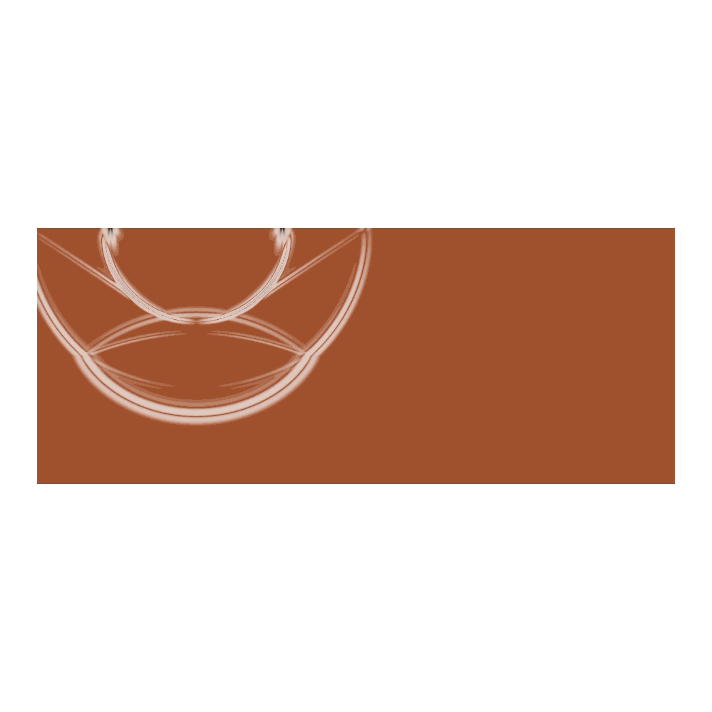
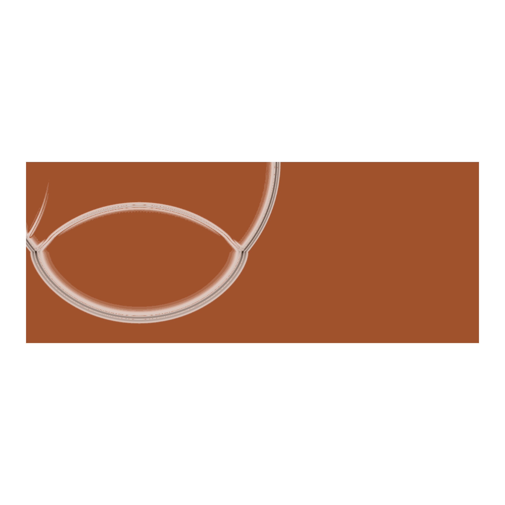
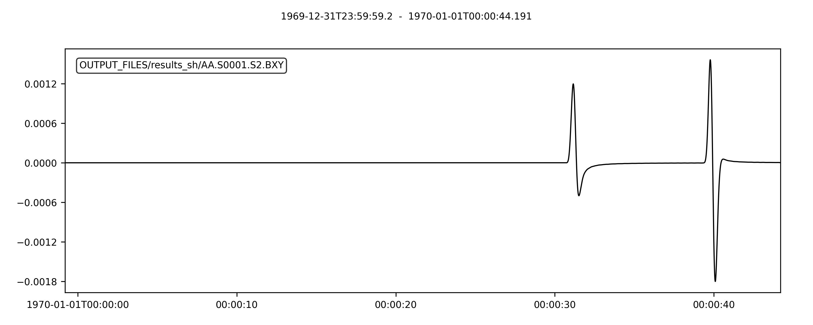

Wave propagration through solid-solid interface
===============================================

In this cookbook we are simulating a medium with two solids. This is a classic
example from the computational seismology class at Princeton University, in which
students are familiarized with wave propagation through an elastic medium.

The model that we are using is a 2D model with a solid-solid interface. The
characteristics of the medium are shown in the figure below.

    Solid-solid interface model with a slow material on top and a fast material
    at the bottom.

The model consists of two materials, one with a slower velocity and the other
with a faster velocity. The model is divided by a horizontal interface. The
source and the receiver are both indicated in the figure and located at the
surface of the model.

We will model wave propagation for both P-SV and SH polarized elastic waves in
the above model.

Setting up the workspace
------------------------

Let's start by creating a workspace from where we can run this example.

.. code-block:: bash

    mkdir -p ~/specfempp-examples/solid-solid-interface
    cd ~/specfempp-examples/solid-solid-interface

We also need to check that the SPECFEM++ build directory is added to the ``PATH``.

.. code:: bash

    which specfem2d

If the above command returns a path to the ``specfem2d`` executable, then the
build directory is added to the ``PATH``. If not, you need to add the build
directory to the ``PATH`` using the following command.

.. code:: bash

    export PATH=$PATH:<PATH TO SPECFEM++ DIRECTORY/bin>

.. note::

    Make sure to replace ``<PATH TO SPECFEM++ DIRECTORY/bin>`` with the
    actual path to the SPECFEM++ directory on your system.

Now let's create the necessary directories to store the input files and output
artifacts.

.. code:: bash

    mkdir -p OUTPUT_FILES
    mkdir -p OUTPUT_FILES/results_psv
    mkdir -p OUTPUT_FILES/results_sh

    touch specfem_config_psv.yaml
    touch specfem_config_sh.yaml
    touch sources.yaml
    touch topography_file.dat
    touch Par_File

Meshing the domain
------------------

We first start by generating a mesh for our simulation domain using
``xmeshfem2D``. To do this, we first define our simulation domain and the
meshing parmeters in a parameter file.

Parameter file
~~~~~~~~~~~~~~

.. literalinclude:: Par_file
    :caption: Par_file
    :language: bash
    :emphasize-lines: 40-56,58-78,118-129

- Like we did in the :ref:`homogeneous_example`, we define the elastic velocity
  model layers in the `Velocity and density models` section of the parameter
  file. This time, however, we define two material systems with different
  elastic parameters as defined in the figure above. First, we adjust the number
  of model materials to 2 using the ``nbmodels`` parameter.

  .. literalinclude:: Par_file
      :caption: Par_file
      :start-at: nbmodels
      :end-at: nbmodels
      :lineno-match:
      :linenos:
      :language: bash

  Then, we then define the velocity model for each material based on the
  parameters in the figure above. We define the elastic material using following
  format

  .. code-block:: bash

      model_number 1 rho Vp Vs 0 0 QKappa Qmu 0 0 0 0 0 0

  Since :math:`\kappa`, :math:`\mu` and :math:`\rho` are provided by the model
  we need to convert them to the velocity parameters :math:`v_p` and :math:`v_s`.

  .. math::

      v_p = \sqrt{\frac{\kappa + 4/3 \mu}{\rho}}\qquad\qquad
      v_s = \sqrt{\frac{\mu}{\rho}}

  and add them to the ``Par_file``:

  .. literalinclude:: Par_file
      :language: bash
      :caption: Par_file
      :start-at: 1 1
      :end-at: 2 1
      :lineno-match:
      :linenos:

  we set the quality factors :math:`Q_{\kappa}` and :math:`Q_{\mu}` to 9999 to
  avoid attenuation in the model.

- Additionally, we define stacey absorbing boundary conditions on all the edges
  of the domain except the top surface using the ``STACEY_ABSORBING_CONDITIONS``,
  ``absorbbottom``, ``absorbright``, ``absorbtop`` and ``absorbleft``
  parameters.

  .. literalinclude:: Par_file
      :language: bash
      :caption: Par_file
      :start-at: STACEY_ABSORBING_CONDITIONS
      :end-at: absorbleft
      :lineno-match:
      :linenos:

- We define a single receiver at the surface of the model at
  :math:`x=150\mathrm{km}` and :math:`z=80\mathrm{km}` in the ``Par_file``.

  .. literalinclude:: Par_file
      :language: bash
      :caption: Par_file
      :start-at:  number of receiver sets
      :end-at: stations_filename
      :lineno-match:
      :linenos:

  We define one receiver set ``nreceiversets`` and a single receiver ``nrec``
  located.

Defining the topography of the domain
~~~~~~~~~~~~~~~~~~~~~~~~~~~~~~~~~~~~~

We define the bounds and topography of the domain using the following topography
file

.. literalinclude:: topography_file.dat
    :caption: topography_file.dat
    :language: bash
    :emphasize-lines: 11-13,17-19,23-25

With 38 elements vertically in each layer.

Running ``xmeshfem2D``
~~~~~~~~~~~~~~~~~~~~~~

To execute the mesher run

.. code:: bash

    xmeshfem2D -p Par_File

.. note::

    Make sure either your are in the executable directory of SPECFEM2D kokkos or
    the executable directory is added to your ``PATH``.

Note the path of the database file and a stations file generated after
successfully running the mesher.

Defining the source
~~~~~~~~~~~~~~~~~~~

We define the source location and the source time function in the source file.

.. literalinclude:: sources.yaml
    :caption: sources.yaml
    :language: yaml
    :emphasize-lines: 4-5,10,13

We define the source at the surface of the model at :math:`x=50\mathrm{km}`
and :math:`z=80\mathrm{km}`, with a first derivative of a Gaussian source time
function with a dominant frequency of 1.5 Hz.

Running the P-SV simulation
---------------------------

To run the solver, we first need to define a configuration file
``specfem_config_psv.yaml``. The ``_psv`` just to distuinguish this
configuration to solve for the P-SV polarized elastic wave propagation from later on
solved SH polarized elastic wave propagation.

.. literalinclude:: specfem_config_psv.yaml
    :language: yaml
    :caption: specfem_config_psv.yaml
    :emphasize-lines: 30-39,41-46

For the ``specfem_config_psv.yaml`` file, nothing has changed compared to the
previous example, :ref:`homogeneous_example`. With the configuration file in
place, we can run the solver using the following command

.. code:: bash

    specfem2d -p specfem_config_psv.yaml

A snapshot of the wavefield at timestep 1100 (:math:`t=9.9\mathrm{s}`) is shown
below.

    Snapshot of the wavefield at timestep 1100 (:math:`t=9.9\mathrm{s}`).

.. note::

    The wavefield snapshots are currently not being generated with this setup.

The first (P) wavefront in the upper half of the medium reaches the horizontal
center of model after 9 seconds, which is intuitive since the P-wave velocity
in the upper half of the model is almost :math:`6\mathrm{km}/\mathrm{s}`.

The seismograms recorded at the receiver location are shown below.

.. figure:: seismograms_psv.png
    :width: 800
    :alt: seismograms

    Seismograms recorded at the receiver location.

And the plot can be reproduced using the following python script

.. literalinclude:: plot_psv.py
    :language: python
    :caption: plot_psv.py

Running the SH simulation
-------------------------

To run the solver, we first need to define a configuration file
``specfem_config_sh.yaml``.

.. literalinclude:: specfem_config_sh.yaml
    :language: yaml
    :caption: specfem_config_sh.yaml
    :emphasize-lines: 30-39,41-46

For the ``specfem_config_sh.yaml`` file, nothing has changed compared to the
previous example, :ref:`homogeneous_example`. With the configuration file in
place, we can run the solver using the following command

.. code:: bash

    specfem2d -p specfem_config_sh.yaml

A snapshot of the wavefield at timestep 1100 (:math:`t=9.9\mathrm{s}`) is shown
below.

    Snapshot of the wavefield at timestep 1100 (:math:`t=9.9\mathrm{s}`).

.. note::

    The wavefield snapshots are currently not being generated with this setup.

The SH wave has still not reach the vertical center of the model after 9.9 seconds,
which is intuitive since the SH-wave velocity in the upper half of the model is
:math:`\sim3.2\mathrm{km}/\mathrm{s}`.

To see the SH interacting with the solid-solid interface, we need to run the
simulation for a longer time. Here, another snapshot of the wavefield at
timestep 2200 (:math:`t=19.8\mathrm{s}`) is shown below.

    Snapshot of the wavefield at timestep 2200 (:math:`t=19.8\mathrm{s}`).
    The SH wave has now reached the solid-solid interface and is propagating
    through the model.

The seismograms recorded at the receiver location are shown below.

    Seismograms recorded at the receiver location.

And the plot can be reproduced using the following python script

.. literalinclude:: plot_sh.py
    :language: python
    :caption: plot_sh.py
