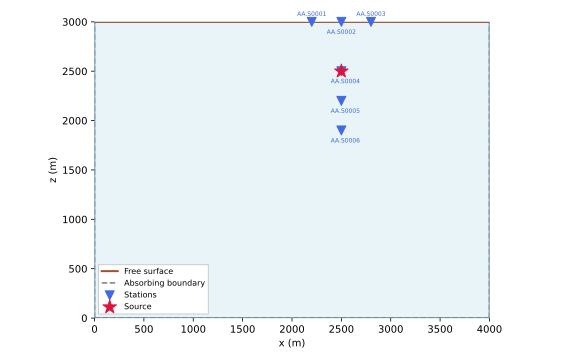
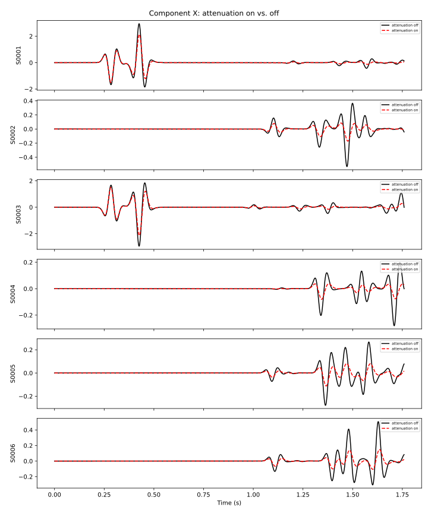
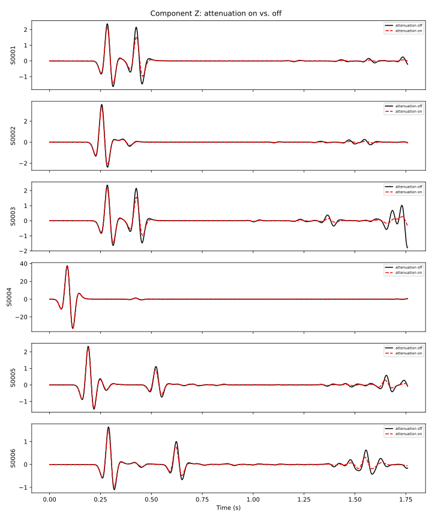

.. _attenuation_example:

Elastic wave propagation with and without attenuation
======================================================

In this example (see :repo-file:`benchmarks/src/dim2/homogeneous-medium-flat-topography-attenuation`)
we simulate wave propagation through the same 2-dimensional homogeneous elastic medium as in
:ref:`homogeneous_example`, but run the simulation twice: once without attenuation and once with
viscoelastic attenuation enabled. Comparing the two sets of seismograms reveals the amplitude
decay and velocity dispersion introduced by attenuation.

.. note::

    All cookbook files can be copy and pasted from the code blocks below, or you
    can download a zip file containing all the files needed to run this example.

    .. download-folder:: parameter_files
        :filename: attenuation_cookbook.zip
        :text: Attenuation cookbook

Setting up your workspace
--------------------------

Let's start by creating a workspace from where we can run this example.

.. code-block:: bash

    mkdir -p ~/specfempp-examples/attenuation
    cd ~/specfempp-examples/attenuation

We also need to check that the SPECFEM++ executable directory is added to the
``PATH``.

.. code:: bash

    which specfem

If the above command returns a path to the ``specfem`` executable, then the
executable directory is added to the ``PATH``. If not, you need to add the executable
directory to the ``PATH`` using the following command.

.. code:: bash

    export PATH=$PATH:<PATH TO SPECFEM++ DIRECTORY/bin>

.. note::

    Make sure to replace ``<PATH TO SPECFEM++ DIRECTORY/bin>`` with the
    actual path to the SPECFEM++ directory on your system.

Now let's create the necessary directories for both simulation variants.

.. code:: bash

    mkdir -p OUTPUT_FILES/attenuation_off/results
    mkdir -p OUTPUT_FILES/attenuation_on/results
    mkdir -p OUTPUT_FILES/results

    touch specfem_config_attenuation_off.yaml
    touch specfem_config_attenuation_on.yaml
    touch source.yaml
    touch Par_File_attenuation_off
    touch Par_File_attenuation_on
    touch topography.dat

Generating the mesh
--------------------

Both simulation variants use the same homogeneous medium and identical mesh, so the
mesh generation steps are the same except for the output directory. We run ``xmeshfem2D``
separately for each variant so that the STATIONS file and database are written to the
correct subdirectory.

Parameter File (without attenuation)
~~~~~~~~~~~~~~~~~~~~~~~~~~~~~~~~~~~~~

.. literalinclude:: parameter_files/Par_File_attenuation_off
    :caption: Par_File_attenuation_off
    :language: bash
    :emphasize-lines: 90

The key parameter is the material definition on line 90: ``QKappa=9999 Qmu=9999`` — setting
both quality factors to 9999 tells the solver to treat the medium as purely elastic (no
attenuation).

Parameter File (with attenuation)
~~~~~~~~~~~~~~~~~~~~~~~~~~~~~~~~~~~

.. literalinclude:: parameter_files/Par_File_attenuation_on
    :caption: Par_File_attenuation_on
    :language: bash
    :emphasize-lines: 90

The only difference is the material line: ``QKappa=100 Qmu=50`` — these finite quality
factors activate viscoelastic attenuation. Lower Q values mean stronger attenuation, making
the effect clearly visible in the seismograms.

.. note::

    ``Qmu`` is always equal to ``Qs``. ``QKappa`` is in general not equal to ``Qp``; see
    ``doc/Qkappa_Qmu_versus_Qp_Qs_relationship_in_2D_plane_strain.pdf`` for the conversion.

Topography file
~~~~~~~~~~~~~~~~

.. literalinclude:: parameter_files/topography.dat
    :caption: topography.dat
    :language: bash

The topography file defines the mesh interfaces. The model has a single layer spanning
a 4000 m × 3000 m domain, discretized into 80 × 60 spectral elements.

Running ``xmeshfem2D``
~~~~~~~~~~~~~~~~~~~~~~~

Generate the mesh database for each variant:

.. code:: bash

    xmeshfem2D -p Par_File_attenuation_off
    xmeshfem2D -p Par_File_attenuation_on

Each directory should now contain ``database.bin`` and ``STATIONS`` files, along with VTK
files for visualization.

Defining sources
-----------------

Both runs share the same source, defined in a single YAML file. For a full description
of source parameters refer to :ref:`source_description`.

.. literalinclude:: parameter_files/source.yaml
    :caption: source.yaml
    :language: yaml
    :emphasize-lines: 4-5,10-13

A single point force source is placed at the center of the domain (2500 m, 2500 m) and
excited with a Ricker wavelet at a peak frequency of 12.5 Hz.

Configuring the solver
-----------------------

Without attenuation
~~~~~~~~~~~~~~~~~~~~

.. literalinclude:: parameter_files/specfem_config_attenuation_off.yaml
    :caption: specfem_config_attenuation_off.yaml
    :language: yaml

This configuration uses the Newmark time scheme with ``dt=1.1e-3`` s for 1600 steps
(total simulation time ~1.76 s). There is no ``attenuation`` section, so the solver
treats the medium as purely elastic.

With attenuation
~~~~~~~~~~~~~~~~~

.. literalinclude:: parameter_files/specfem_config_attenuation_on.yaml
    :caption: specfem_config_attenuation_on.yaml
    :language: yaml
    :emphasize-lines: 33-38

The attenuation-enabled configuration adds the ``attenuation`` section (lines 33–38):

- **enabled**: Set to ``true`` to activate viscoelastic attenuation.
- **reference-frequency**: The frequency at which the velocity model is specified.
  Set to 30 Hz, within the source frequency band.
- **attenuation-frequency-band**: The band ``[f_min, f_max]`` over which the standard
  linear solid (SLS) mechanism approximates the target Q. Set to ``[3 Hz, 300 Hz]``
  to bracket the 12.5 Hz source peak. Choose this band to cover the dominant
  frequencies of your source.

Running the solver
-------------------

Run both variants back-to-back (or in parallel if resources allow):

.. code:: bash

    specfem 2d -p specfem_config_attenuation_off.yaml
    specfem 2d -p specfem_config_attenuation_on.yaml

.. note::

    Make sure either you are in the executable directory of SPECFEM++ or the
    executable directory is added to your ``PATH``.

Each run writes seismograms to its respective ``OUTPUT_FILES/<variant>/results/``
directory.

Visualizing the geometry
-------------------------

The following script plots the model domain, source location, and receiver positions
to verify the setup before running the solver.

.. literalinclude:: parameter_files/plot_geometry.py
    :language: python

.. code:: bash

    python plot_geometry.py

Expected geometry:

   Model geometry showing the 4000 m × 3000 m domain, absorbing boundaries (dashed
   gray), the source (red star), and receiver locations (blue triangles).

Visualizing seismograms
------------------------

The following Python script reads both sets of seismograms with ``obspy`` and produces
comparison plots for the X and Z components.

.. literalinclude:: parameter_files/plot_traces.py
    :language: python

.. code:: bash

    python plot_traces.py

The comparison plots are saved to ``OUTPUT_FILES/results/``.

Expected results
~~~~~~~~~~~~~~~~

   X-component (horizontal) velocity seismograms comparing the elastic run (black)
   with the viscoelastic run (red dashed).

   Z-component (vertical) velocity seismograms comparing the elastic run (black)
   with the viscoelastic run (red dashed).

In both figures you should observe:

* **Amplitude decay**: the attenuating run (red) has lower peak amplitudes, especially
  at later arrival times and higher-frequency content.
* **Phase shift / velocity dispersion**: attenuation is physically linked to dispersion
  (Kramers–Kronig relations), so the attenuating wavefield arrives very slightly earlier
  or later depending on frequency.
* **Waveform broadening**: high-frequency energy is preferentially absorbed, causing
  the waveform to appear smoother in the attenuating run.

About attenuation in SPECFEM++
---------------------------------

SPECFEM++ models viscoelastic attenuation using the standard linear solid (SLS)
mechanism, implemented via memory variables (also called internal variables). The
approach closely follows Komatitsch & Tromp (1999). The quality factors ``QKappa``
and ``Qmu`` in the Par_File control compressional and shear attenuation respectively.
Setting either to ``9999`` effectively disables that component of attenuation.

The ``attenuation-frequency-band`` in the solver configuration determines over which
bandwidth the SLS approximation is optimized. For best accuracy, set this band to
encompass the dominant frequency content of your source.

For full documentation of attenuation parameters refer to :ref:`parameter_documentation`.
