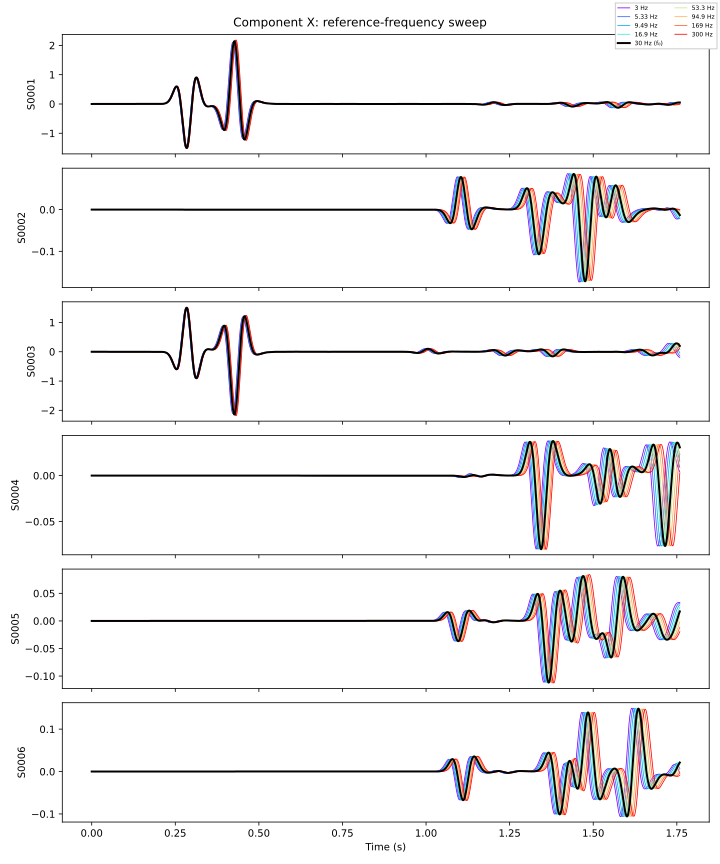
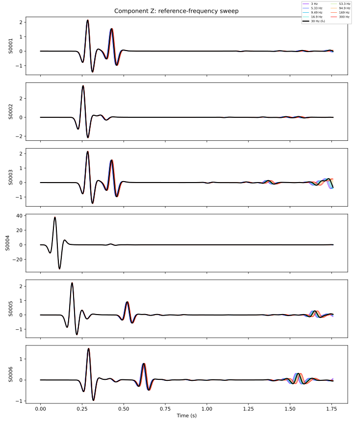

.. _reference_frequency_example:

Effect of the reference frequency on viscoelastic attenuation
=============================================================

In this example (see :repo-file:`benchmarks/src/dim2/homogeneous-medium-flat-topography-reference-frequency`)
we use the same homogeneous attenuating medium as in :ref:`attenuation_example`
(QKappa = 100, Qmu = 50) but run nine simulations where only the
``reference-frequency`` in the solver configuration changes. The nine values are
logarithmically spaced from F₀/10 to F₀×10 around the central value F₀ = 30 Hz,
giving four frequencies below, the exact center, and four above.
Overlaying all nine seismograms with a rainbow colormap — and the central
frequency in black — reveals how the choice of reference frequency shifts the
apparent velocity and amplitude of the wavefield through velocity dispersion.

.. note::

    All cookbook files can be copy and pasted from the code blocks below, or you
    can download a zip file containing all the files needed to run this example.

    .. download-folder:: parameter_files
        :filename: reference_frequency_cookbook.zip
        :text: Reference-frequency cookbook

Setting up your workspace
-------------------------

.. code-block:: bash

    mkdir -p ~/specfempp-examples/reference-frequency
    cd ~/specfempp-examples/reference-frequency

Check that the SPECFEM++ executables are on your ``PATH``:

.. code:: bash

    which specfem

If not, add the bin directory:

.. code:: bash

    export PATH=$PATH:<PATH TO SPECFEM++ DIRECTORY/bin>

Create the output directories:

.. code:: bash

    mkdir -p OUTPUT_FILES/mesh
    mkdir -p OUTPUT_FILES/results

    touch Par_File
    touch source.yaml
    touch topography.dat
    touch specfem_config.yaml.in

Generating the mesh
-------------------

All nine simulations share the same geometry and material properties, so the
mesh is generated only once.

Parameter File
~~~~~~~~~~~~~~

.. literalinclude:: parameter_files/Par_File
    :caption: Par_File
    :language: bash
    :emphasize-lines: 90

The single material layer uses ``QKappa=100 Qmu=50`` (line 90), enabling
viscoelastic attenuation for all runs.

Topography file
~~~~~~~~~~~~~~~

.. literalinclude:: parameter_files/topography.dat
    :caption: topography.dat
    :language: bash

Running ``xmeshfem2D``
~~~~~~~~~~~~~~~~~~~~~~

.. code:: bash

    xmeshfem2D -p Par_File

This writes ``OUTPUT_FILES/mesh/database.bin`` and
``OUTPUT_FILES/mesh/STATIONS``, which are shared by all nine solver runs.

Defining the source
-------------------

.. literalinclude:: parameter_files/source.yaml
    :caption: source.yaml
    :language: yaml

A single point force at the domain center, excited with a Ricker wavelet at
12.5 Hz.

Configuring the solver
----------------------

Instead of writing nine separate YAML files by hand, we use a single template
and a short Python script to stamp it out. The template uses Python-style
``{…}`` placeholders for the two values that vary across runs.

.. literalinclude:: parameter_files/specfem_config.yaml.in
    :caption: specfem_config.yaml.in
    :language: yaml
    :emphasize-lines: 24,26-31,49

The highlighted lines are the only values that change across runs:

- **directory** (line 24): seismograms are written to
  ``OUTPUT_FILES/freq_<tag>/results`` so each run has its own output folder.
- **attenuation block** (lines 26–31): the ``reference-frequency`` (line 28)
  is the frequency at which the elastic moduli are specified. Changing this
  shifts the velocity dispersion curve relative to the source spectrum.
- **log-file** (line 49): the per-run log path, also stamped with
  ``{freq_tag}``.

Running the solver
------------------

First generate the nine config files from the template:

.. literalinclude:: parameter_files/generate_configs.py
    :caption: generate_configs.py
    :language: python

.. code:: bash

    python generate_configs.py

This writes ``OUTPUT_FILES/freq_00/specfem_config.yaml`` through
``OUTPUT_FILES/freq_08/specfem_config.yaml``, one per reference frequency.

Then run the solver for each variant:

.. code:: bash

    for config in OUTPUT_FILES/freq_*/specfem_config.yaml; do
        specfem 2d -p "$config"
    done

.. note::

    If you have multiple cores available you can parallelise the runs with
    ``xargs``:

    .. code:: bash

        ls OUTPUT_FILES/freq_*/specfem_config.yaml | xargs -P 4 -I{} specfem 2d -p {}

Visualizing seismograms
-----------------------

The following script reads all nine sets of seismograms and produces
comparison plots for the X and Z components.

.. literalinclude:: parameter_files/plot_traces.py
    :language: python

.. code:: bash

    python plot_traces.py

Expected results
~~~~~~~~~~~~~~~~

   X-component (horizontal) velocity seismograms for all nine reference
   frequencies. The rainbow colormap runs from low (red) to high (violet)
   frequency; the central value 30 Hz is shown in black.

   Z-component (vertical) velocity seismograms for the same sweep.

In both figures you should observe:

* **Velocity dispersion**: the wavefield arrives slightly earlier or later
  depending on the reference frequency, because the SLS mechanism shifts the
  phase velocity of each frequency component differently.
* **Amplitude variation**: the reference frequency controls the peak of the
  relaxation curve, so runs where the dominant source energy falls above or
  below the reference frequency show different amplitude levels.
* **Convergence at the center**: the black trace (30 Hz) represents the
  "correct" reference for a 12.5 Hz Ricker source and serves as the baseline.

About the reference frequency
-----------------------------

SPECFEM++ models viscoelastic attenuation using the standard linear solid
(SLS) mechanism. The ``reference-frequency`` is the frequency at which the
velocity model is specified: at this frequency the phase velocity equals
exactly the input ``Vp`` and ``Vs``. Away from the reference frequency, the
Kramers–Kronig relations impose a corresponding phase-velocity dispersion.

Choosing a reference frequency well within the source bandwidth (i.e. near the
dominant frequency of your Ricker wavelet) minimises the apparent velocity
error. Choosing it outside the band causes a systematic shift of the entire
wavefield. This example makes that effect visible by sweeping the reference
frequency over two decades while keeping everything else fixed.

For full documentation of attenuation parameters refer to
:ref:`parameter_documentation`.
