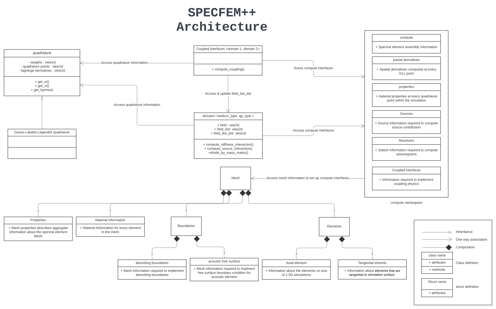

:orphan:

.. _architecture:

SPECFEM++ Architecture
======================

SPECFEM++ is designed with portability and modularity as primary goals. The goal is develop a code that is easy to maintain and extend, while maintaining performance characteristics of original `SPECFEM2D solver <https://specfem2d.readthedocs.io>`_. This is achieved using C++ templatized classes.

The code is divided into set of modules (classes and structs), the major of which to understand code architecture are:

1. Quadrature : This module defines the quadrature rules used to compute differentials and integrals.
2. Mesh : Mesh struct defines the IO routines and data structures used to read and store mesh generated by internal meshing tools or external meshing tools such as CUBIT.
3. Compute : Compute struct defines data structures used to compute and store velocity models, spatial derivatives, source and receiver properties, coupled interface location and properties, and other data structures required to compute the evolution of the wavefield at each time step. The compute struct provides an interface layer where the developer can access simulation data at any timestep.
4. Domain : Domain is a templated class which defines methods required to compute the evolution of the wavefield at each time step. The class is templated on type of domain (acoustic, elastic, poroelastic, etc.), where we define specialized template implementations for each domain type.
   The domain class in itself defines (Kokkos) parallelism used to compute the evolution of the wavefield. The physics of the domain is defined by specialized templated element, source and receiver classes. This lets us separate the physics of the domain from the parallelism, which should make it easier to extend the code to different physics.
5. Coupling Interfaces : ``coupled_interfaces`` class defines the methods used to compute coupling between different domains. The class is templated on the two domains that are coupled (``self_domain_type``, ``coupled_domain_type``), where we define specialized template implementations for different domain combinations.
   Similar to the domain class, the coupling interface class in itself defines (Kokkos) parallelism used to compute the coupling between the two domains. The physics of the coupling is defined by specialized templated edge class.

   SPECFEM Architecture.

.. toctree::
   :maxdepth: 1

   quadrature
   mesh
   assembly
   domain
