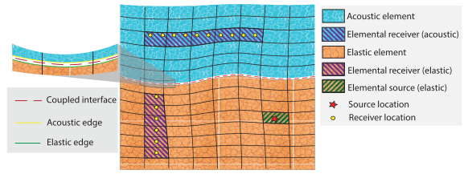

.. _domain_coupled_interface_dev_guide:

Domain and Coupled Interface Developer Guide
============================================

``specfem::domain::domain`` is a templated C++ class. A templated domain class allows us to provide cookie-cutter parallelism frameworks while allowing developers to describe the physics at elemental level ``specfem::domain::impl::elements``. This developer guide provides an in-depth methodology for understanding and extending the domain class to implement new physics.

Brief introduction to C++ templates
-----------------------------------

C++ templates are a powerful tool for generic programming. They allow us to write code that is independent of the type of data it operates on.

.. code-block:: C++

    template <typename T>
    T add(T a, T b) {
        return a + b;
    }

For example the function above, adds two numbers without knowing whether they are integers, floating point numbers, or complex numbers. The compiler will generate a different version of the function for each type of data. Thus the compiler needs to know the type of data at compile time. In modern compilers (C++17 and above) the compiler can utilize type deduction to infer the type of data from the function arguments.

The power of templates for writing portable code becomes obvious when using user defined types. For example, consider the following function which allows us to calculate L2 norm of a vector in dimension independent manner.

.. code-block:: C++

    class dim2{
    public:
        constexpr int dim = 2;
    };

    class dim3{
    public:
        constexpr int dim = 3;
    };

    template <typename T>
    double l2_norm(const std::vector<double> vec) {
        double norm = 0.0;
        assert(vec.size() == T::dim;
        for (int i = 0; i < T::dim; i++) {
            norm += vec[i] * vec[i];
        }
        return std::sqrt(norm);
    }

There are a couple of key points to note here from a performance standpoint:

1. The compiler will generate a different version of the function for each dimension.
2. Since ``T::dim`` is a ``constexpr`` the compiler will unroll the loop - which on modern CPUs and GPUs can lead to significant performance gains.

Apart from performance, templates also provide us a way to define a generic interface for different types of data i.e. in the above code we didn't need to write two different functions for `dim2` and `dim3` vectors. The importance of this in SPECFEM++ context will become clear in the following sections.

Anatomy of a SPECFEM++ Domain and Coupled Interface
---------------------------------------------------

The following figure shows the different components of a SPECFEM++ domain and coupled interface.

   Schematic of elements of domain and coupled interface. Each of the elements are implemented as C++ objects within SPECFEM++.

As the name suggests ``specfem::domain::domain`` is closely related to a spectral element domain. The domain is comprised of set of finite elements. The finite element method provide us a way to descritize the domain into small elements where we can approximate the solution using a polynomial basis. The approach is then to compute the coefficients of the polynomial basis at elemental levels which greatly reduces the computational cost.

Similaly, coupled interface is a set of finite element edges which are used to describe coupling physics between different domains. Each edge contains a mapping between coupled GLL points between the 2 domains.

.. note::

    While the above figure depicts the finite elements are conforming between the 2 domains, this is not a nacessity. For example, non-conforming elements are used to describe the coupling physics at a fault.

Let us look at computing the contribution of acoustic domain to global :math:`\frac {\partial \chi}{\partial t^2}`. The mathematical formulation to which is given by `Komatitsch and Tromp, 2002 <https://doi.org/10.1046/j.1365-246X.2002.01653.x>`_:

.. math::

    \int \kappa^{-1} w \partial_t^2 \chi dV = - \int \rho^{-1} \nabla w \cdot \nabla \chi dV + \int w \hat{n} \cdot \partial_t s dS

Where the first term on the right hand side is the contribution from the acoustic domain and the second term is the contribution from the coupled interface. The above equation is evaluated at each GLL point in the domain. Thus the contribution from the acoustic domain at elemental level is given by:

.. math::

    \int_{\Omega_e} \rho^{-1} \nabla w \cdot \nabla \chi dV \approx \sum_{\alpha, \beta, \gamma = 0}^{n_{\alpha}, n_{\beta}, n_{\gamma}} w^{\alpha \beta \gamma} \left[ \omega_{\beta} \omega_{\gamma} \sigma_{\xi}  + \omega_{\alpha} \omega_{\gamma} \sigma_{\eta} + \omega_{\alpha} \omega_{\beta} \sigma_{\zeta} \right]

where:

.. math::

    \sigma_{\xi} = \sum_{\alpha' = 0}^{n_{\alpha}} \omega_{\alpha'} J^{\alpha' \beta \gamma} \left( \rho^{\alpha' \beta \gamma} \right)^{-1} \left( \partial_1 \chi \right)^{\alpha' \beta \gamma} l'_{\alpha} \left( \xi_{\alpha'} \right)

    \sigma_{\eta} = \sum_{\beta' = 0}^{n_{\beta}} \omega_{\beta'} J^{\alpha \beta' \gamma} \left( \rho^{\alpha \beta' \gamma} \right)^{-1} \left( \partial_2 \chi \right)^{\alpha \beta' \gamma} l'_{\beta} \left( \eta_{\beta'} \right)

    \sigma_{\zeta} = \sum_{\gamma' = 0}^{n_{\gamma}} \omega_{\gamma'} J^{\alpha \beta \gamma'} \left( \rho^{\alpha \beta \gamma'} \right)^{-1} \left( \partial_3 \chi \right)^{\alpha \beta \gamma'} l'_{\gamma} \left( \zeta_{\gamma'} \right)

The terms :math:`J^{\alpha' \beta \gamma} \left( \rho^{\alpha' \beta \gamma} \right)^{-1} \left( \partial_1 \chi \right)^{\alpha' \beta \gamma}` is what we call stress integrand in SPECFEM++. Finally, the gradient of the potential (i.e. :math:`\partial_i \chi`) is given by:

.. math::

    \left( \partial_i \chi \right)^{\alpha \beta \gamma} = \sum_{\alpha = 0}^{n_{\alpha}} \chi^{\alpha \beta' \gamma'} l'_{\alpha} \left( \xi_{\alpha'} \right) \partial_i \xi + \sum_{\beta = 0}^{n_{\beta}} \chi^{\alpha' \beta \gamma'} l'_{\beta} \left( \eta_{\beta'} \right) \partial_i \eta + \sum_{\gamma = 0}^{n_{\gamma}} \chi^{\alpha' \beta' \gamma} l'_{\gamma} \left( \zeta_{\gamma'} \right) \partial_i \zeta

There are several key features of this equation that can be exploited when designing the domain class:

1. As with any finite element code, the integration over a whole domain involves computing the elemental contribution at all GLL points within that domain.
2. The elemental contribution at each GLL point is independent of the other GLL points and is independent of other elements in the domain.

Thus we can design the domain class in an element agnostic way. The domain class provides a generic interface to compute the elemental contribution of a given physics - separating the physics from the parallelism.

.. note::

    Later we will see a similar analogy of separating the physics from parallelism can be drawn between coupled interface and finite element edges.

Understanding the parallelism
------------------------------

Let us now look at a naive serial implementation for the above formulation in 3D.

.. code:: C++

    void compute_acoustic_stiffness_interaction() {
        for (int ispec = 0; ispec < nspec; i++) {
            for (int iz = 0; iz < ngllz; iz++) {
                for (int iy = 0; iy < ngllz; iy++) {
                    for (int ix = 0; ix < ngllx; ix++) {
                        // compute the global index of the GLL point
                        iglob = ibool(ispec, iz, iy, ix); // ibool is the mapping vector from GLL point to global index
                        // compute gradient at GLL point ix, iy, iz
                        acoustic_element.compute_gradient(ix, iy, iz);
                        // compute stresses at GLL point ix, iy, iz
                        acoustic_element.compute_stresses(ix, iy, iz);
                        // compute the md2chidt2 at GLL point ix, iy, iz
                        type_real md2chidt2 = acoustic_element.compute_acceleration(ix, iy, iz);
                        // add the contribution to the global vector
                        potential_dot_dot[iglob] += md2chidt2;
                    }
                }
            }
        }
    }

Since the computations in each dimension are independent of each other we can simplify the above code even further.

.. code:: C++

    void compute_acoustic_stiffness_interaction() {
        for (int ispec = 0; ispec < nspec; i++) {
            for (int xyz = 0; xyx < ngllxyz; xyx++) {
               auto [ix, iy, iz] = sub2ind(xyz);
               // compute the global index of the GLL point
               iglob = ibool(ispec, iz, iy, ix); // ibool is the mapping vector from GLL point to global index
               // compute gradient at GLL point ix, iy, iz
               acoustic_element.compute_gradient(ix, iy, iz, <other_arguments>);
               // compute stresses at GLL point ix, iy, iz
               acoustic_element.compute_stresses(ix, iy, iz, <other_arguments>);
               // compute the md2chidt2 at GLL point ix, iy, iz
               type_real md2chidt2 = acoustic_element.compute_acceleration(ix, iy, iz, <other_arguments>);
               // add the contribution to the global vector
               potential_dot_dot[iglob] += md2chidt2;
            }
        }
    }

Now let us template the above code to make it dimension independent using a bit of macro magic.

.. code:: C++

    #ifdef DIM2
        #define INDEX iz,ix
    #endif

    #ifdef DIM3
        #define INDEX iz,iy, ix
    #endif

    template <typename quadrature_points>
    void compute_acoustic_stiffness_interaction() {
        for (int ispec = 0; ispec < nspec; i++) {
            for (int qp = 0; qp < dimension::get_num_qp(); qp++) {
                auto [INDEX] = sub2ind(qp);
                // rest of the code
                ...
            }
        }
    }

Kokkos parallelism
..................

The above code is a good starting point for parallelizing the code. A naive method of parallelizing the above section would be to distribute the 2 for loops among the available threads for example using OpenMP `collapse(2)` clause. However, since different elements could have different implementation (physics) for calculating the gradient, stresses, and acceleration contribution such a parallelization would result in poor performance on GPUs cause of warp divergence. Even on CPUs the performance would be poor since compiler could miss vectorization opportunities.

Kokkos provides a natural formalism to exploit this type of parallelism using `heirarchical parallelism <https://kokkos.github.io/kokkos-core-wiki/ProgrammingGuide/HierarchicalParallelism.html>`_ . The idea is to parallelize the outer loop over elements using Kokkos teams and then parallelize the inner loop over quadrature points using Kokkos thread teams. This guarantees that all the threads in a team (which is mapped to CUDA blocks on NVIDIA GPUs) execute the same code path - thus avoiding warp divergence.

.. code:: C++

    template <typename quadrature_points>
    void compute_acoustic_stiffness_interaction() {
        Kokkos::parallel_for("compute_acoustic_stiffness_interaction", Kokkos::TeamPolicy<execution_space>(nspec, Kokkos::AUTO), KOKKOS_LAMBDA(const Kokkos::TeamPolicy<execution_space>::member_type& team) {
            int ispec = team.league_rank();
            Kokkos::parallel_for(Kokkos::TeamThreadRange(team, dimension::get_num_qp()), [=] (const int& qp) {
                auto [INDEX] = sub2ind(qp);
                // rest of the code
                ...
            });
        });
    }

Optimizing using shared/cache memory
....................................

At this point, it would be good to look at elmental implementations to understand the performance bottlenecks. Let us start by looking at function to compute the gradient of the potential inside a 2D acoustic element.

.. code:: C++

    class acoustic_element {
        void compute_gradient(
            const int &ispec, const int &xz, const View2d<type_real> hprime_xx,
            const View2d<type_real> hprime_zz, const View1d<type_real> field_chi,
            type_real *dchidxl, type_real *dchidzl){

            int ix, iz, iglob;
            sub2ind(xz, NGLL, iz, ix);

            const type_real xixl = this->xix(ispec, iz, ix);
            const type_real gammaxl = this->gammax(ispec, iz, ix);
            const type_real xizl = this->xiz(ispec, iz, ix);
            const type_real gammazl = this->gammaz(ispec, iz, ix);

            type_real dchi_dxi = 0.0;
            type_real dchi_dgamma = 0.0;

            for (int l = 0; l < ngllx; l++) {
                iglob = ibool(ispec, iz, l)
                dchi_dxi += hprime_xx(ix, l) * field_chi(iglob, 0);
            }

            for (int l = 0; l < ngllz; l++) {
                iglob = ibool(ispec, l, ix)
                dchi_dgamma += hprime_zz(iz, l) * field_chi(iglob, 0);
            }

            // dchidx
            dchidxl[0] = dchi_dxi * xixl + dchi_dgamma * gammaxl;

            // dchidz
            dchidzl[0] = dchi_dxi * xizl + dchi_dgamma * gammazl;

            return;
        }
    };

This implementation is not very efficient since it requires a lot of global memory accesses. In particular, if we look at the inner loop the accesses to `hprime_xx`, `hprime_zz` and `field_chi` are not coalesced. To improve the performance we can use shared memory to cache the values of `hprime_xx`, `hprime_zz` and `field_chi` for each element.

.. code:: C++

    template <typename quadrature_points>
    void compute_acoustic_stiffness_interaction() {

        // allocate shared memory
        typedef Kokkos::DefaultExecutionSpace::scratch_memory_space ScratchSpace;
        // Define a view type in ScratchSpace
        typedef Kokkos::View<type_real**,ScratchSpace,
                    Kokkos::MemoryTraits<Kokkos::Unmanaged>> scratch_view;

        // allocate shared memory for hprime_xx, hprime_zz, and field_chi
        size_t scratch_size =
                    scratch_view::shmem_size(ngllx, ngllx) +
                    scratch_view::shmem_size(ngllx, ngllx) +
                    scratch_view::shmem_size(ngllz, ngllx);

        int scratch_size =
        Kokkos::parallel_for("compute_acoustic_stiffness_interaction", Kokkos::TeamPolicy<execution_space>(nspec, Kokkos::AUTO), KOKKOS_LAMBDA(const Kokkos::TeamPolicy<execution_space>::member_type& team) {
            int ispec = team.league_rank();
            // allocate shared memory
            scratch_view s_hprime_xx(team.team_scratch(0), ngllx, ngllx);
            scratch_view s_hprime_zz(team.team_scratch(0), ngllz, ngllz);
            scratch_view s_field_chi(team.team_scratch(0), ngllz, ngllx);

            // copy data to shared memory
            Kokkos::parallel_for(Kokkos::TeamThreadRange(team, ngllxx), [=] (const int &xx) {
                i = xx % ngllx;
                j = xx / ngllx;
                s_hprime_xx(i, j) = hprime_xx(i, j);
            });

            Kokkos::parallel_for(Kokkos::TeamThreadRange(team, ngllzz), [=] (const int &xx) {
                i = zz % ngllz;
                j = zz / ngllz;
                s_hprime_zz(i, j) = hprime_zz(i, j);
            });

            Kokkos::parallel_for(Kokkos::TeamThreadRange(team, ngllxz) [=] (const int &xz) {
                int ix, iz;
                sub2ind(xz, ngllxz, iz, ix);
                s_field_chi(iz, ix) = field_chi(ibool(ispec, iz, ix), 0);
            });

            team.team_barrier();

            Kokkos::parallel_for(Kokkos::TeamThreadRange(team, dimension::get_num_qp()), [=] (const int& qp) {
                auto ix, iz = sub2ind(qp);

                acoustic_element.compute_gradient(ispec, qp, s_hprime_xx, s_hprime_zz, s_field_chi, dchidxl, dchidzl);
                // rest of the code
                ...
            });
        });
    }

.. note::

    The description provided here serves as a good starting point for understanding the domain class. The actual implementation, while based on ideas presented here, is more complex and optimized for performance.

Specializing elemental implementations
--------------------------------------

Let us next consider the elemental implementation for computing stresses in 2D isotropic elastic element and 2D anisotropic elastic element.

.. math::

    \bf{T(\bf{x} (\xi_{\alpha}, \eta_{beta}, \zeta_{\gamma}), t)} = \bf{c}(\bf{x} (\xi_{\alpha}, \eta_{\beta}, \zeta_{\gamma}), t) : \bf{e}(\bf{x} (\xi_{\alpha}, \eta_{\beta}, \zeta_{\gamma}), t)

The elasticity tensor :math:`C^{ijkl}` for anisotropic elements is a 4th order tensor with 21 independent components. However, for isotropic elements the tensor :math:`\bf{c(x)}` is a diagonal with only 2 independent components given by:

.. math::

    C^{ijkl} = \lambda \delta^{ij} \delta^{kl} + \mu \left( \delta^{ik} \delta^{jl} + \delta^{il} \delta^{jk} \right)

Computationally, the number of accesses from global memory when computing the stresses for isotropic elements is an order or magnitude less than that for anisotropic elements (2 accesses vs 21 accesses). Thus it makes sense to specialize the elemental implementation for isotropic and anisotropic elements.

.. code:: C++

    // definition of element class
    template <typename... properties>
    class element{}

    // specialization for acoustic isotropic elements
    template <>
    class element<dim2, acoustic, isotropic>{
        // implementation specific details
    }

    // specialization for elastic isotropic elements
    template <>
    class element<dim2, elastic, isotropic>{
        // implementation specific details
    }

    // specialization for elastic anisotropic elements
    template <>
    class element<dim2, elastic, anisotropic>{
        // implementation specific details
    }

Using the above specialization we've provided a unified interface for acoustic and elastic elements where we can further specialize those elements based on domain/spectral element properties.

.. note::

    Specializing the elemental implementation for different types of elements is a powerful tool for performance optimization. However, it requires us to launch a different kernel for each type of element. This creates a bookkeeping overhead - where we need to make sure every element is accounted for exactly once. This bookkeeping and launch of the kernels is done by ``specfem::domain::impl::kernels``

.. note::

    The other solution to the above problem is to use a single kernel and use class inheritance and polymorphism to deduce elemental specialization at runtime. However, this approach is not very efficient since GPUs are very inefficient at resolving virtual function calls.

Optimization using loop unrolling
---------------------------------

From some profiling experiments we found that the most computationally intensive loop is the one used to compute gradients and evaluate integrals. The loops is shown below:

.. code-block:: C++

    // compute gradients
    for (int l = 0; l < ngllx; l++) {
        dchi_dxi += s_hprime_xx(ix, l) * s_field_chi(l, ix);
    }

    for (int l = 0; l < ngllz; l++) {
        dchi_dgamma += s_hprime_zz(iz, l) * s_field_chi(iz, l);
    }

.. code-block:: C++

    // evaluate integrals
    for (int l = 0; l < ngllx; l++) {
        temp1 += s_hprimewgll_xx(ix, l) * stress_integrand_xx(l, iz);
    }

    for (int l = 0; l < ngllz; l++) {
        temp2 += s_hprimewgll_zz(iz, l) * stress_integrand_zz(l, ix);
    }

The above loops are not very efficient, especially on the GPU, since there are large number of memory accesses for each iteration. In many applications where SPECFEM++ is used, the number of GLL points is fixed - in most cases 4th order GLL quadrature (NGLL = 5) or 7th order GLL quadrature (NGLL = 8). Thus we can specialize the above methods for those NGLL values and unroll the loops.

.. code:: C++

    template <int NGLL>
    class element<
            dim2, acoustic,
            static_quadrature_points<NGLL>,
            isotropic > {
        void compute_gradient(
            const int &ispec, const int &xz, const ScratchView2d<type_real> hprime_xx,
            const ScratchView2d<type_real> hprime_zz, const ScratchView2d<type_real> field_chi,
            type_real *dchidxl, type_real *dchidzl){

            int ix, iz, iglob;
            sub2ind(xz, NGLL, iz, ix);

            const type_real xixl = this->xix(ispec, iz, ix);
            const type_real gammaxl = this->gammax(ispec, iz, ix);
            const type_real xizl = this->xiz(ispec, iz, ix);
            const type_real gammazl = this->gammaz(ispec, iz, ix);

            type_real dchi_dxi = 0.0;
            type_real dchi_dgamma = 0.0;

    #ifdef KOKKOS_ENABLE_CUDA
    #pragma unroll
    #endif
            for (int l = 0; l < NGLL; l++) {
                dchi_dxi += s_hprime_xx(ix, l, 0) * field_chi(iz, l, 0);
                dchi_dgamma += s_hprime_zz(iz, l, 0) * field_chi(l, ix, 0);
            }

            // dchidx
            dchidxl[0] = dchi_dxi * xixl + dchi_dgamma * gammaxl;

            // dchidz
            dchidzl[0] = dchi_dxi * xizl + dchi_dgamma * gammazl;

            return;
        }
    };

The speedup from the above optimization is significant. For example, for 4th order GLL quadrature the speedup is ~ 4x on NVIDIA A100 GPU.

.. note::

    The key thing to note here is we need to define NGLL at compile time. As stated earlier, in many applications the NGLL = 5 or 8 so we can specialize the above method for those values in our implementation of the solver. However, to support cases when NGLL is not either of those values we have a general, *much slower*, implementation of the above method. So the performance of SPECFEM++, by design, is dependent on the NGLL value.

.. warning::

    The generalized implementation is not included in this release. It will be added soon as a patch release.

Understanding the coupled interface
-----------------------------------

``specfem::coupled_interfaces::coupled_interface`` is a templated C++ class that lets us define coupling physics between two types of domains. Similar to ``specfem::domain::domain`` class the ``specfem::coupled_interfaces::coupled_interface`` class serves as parallelism framework to implement the coupling physics defined inside ``specfem::coupled_interface::impl::edge`` class.

Let us now look at the mathematical formulation for the coupling physics on the coupling interface (:math:`\Gamma`) between elastic and acoustic domains as described on the elastic side by `Komatitsch and Tromp, 2002 <https://doi.org/10.1046/j.1365-246X.2002.01653.x>`_:

.. math::

    \int_{\Gamma} p \hat{n} \cdot w d\Gamma = \sum_b \int_{\Gamma_b} p \hat{n} \cdot w d\Gamma_b \approx \sum_b \sum_{\alpha, \beta = 0}^{n_{\alpha}, n_{\beta}} \omega_{\alpha} \omega_{\beta} J_b^{\alpha \beta} \dot{\chi}(t) \sum_{i = 1}^{3} w_i^{\alpha \beta} \hat{n}_i^{\alpha \beta}

Again, similar to a methodology described in section `Understanding the parallelism`_ we can describe the the outer summation over all edges using Kokkos teams and the inner summation over all quadrature points using Kokkos thread teams. This ensures that we avoid warp divergence on GPUs and potentially benefit from vectorization on CPUs.

.. code-block:: C++

    void compute_coupling(){
        Kokkos::parallel_for(
            "specfem::coupled_interfaces::coupled_interfaces::compute_coupling",
            specfem::kokkos::DeviceTeam(this->nedges, Kokkos::AUTO, 1),
            KOKKOS_CLASS_LAMBDA(
                const specfem::kokkos::DeviceTeam::member_type &team_member) {
            // Get number of quadrature points
            int ngllx, ngllz;
            quadrature_points.get_ngll(&ngllx, &ngllz);
            int iedge_l = team_member.league_rank();
            // Get the edge
            const auto self_edge_l = this->self_edge(iedge_l);
            const auto coupled_edge_l = this->coupled_edge(iedge_l);

            auto npoints = specfem::assembly::coupled_interfaces::iterator::npoints(
                self_edge_l, ngllx, ngllz);

            // Iterate over the edges using TeamThreadRange
            Kokkos::parallel_for(
                Kokkos::TeamThreadRange(team_member, npoints),
                    [=](const int ipoint) { edge.compute_coupling(iedge_l, ipoint); });
        });
    }
