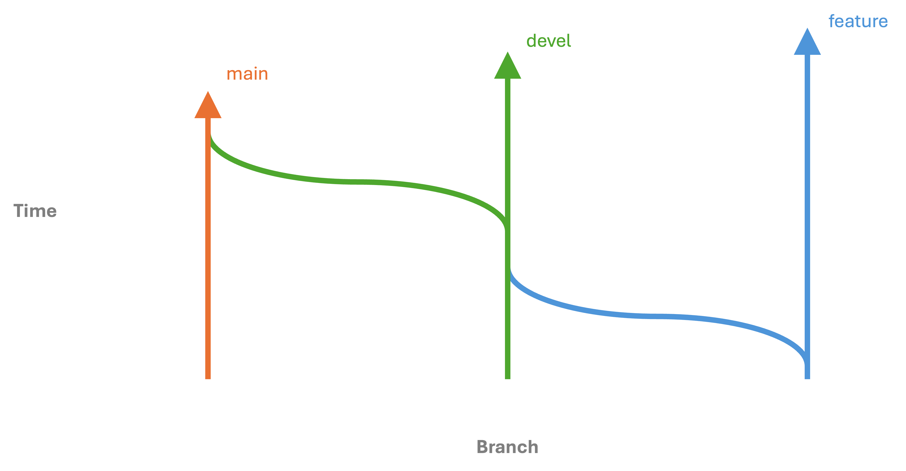

.. _git-workflow:

Git development workflow
========================

At SPECFEM++ we follow main-develop workflow. The `main` branch is always a
stable working code and is generally synced with the latest release of
SPECFEM++. The `devel` branch is a stable code with potentially new features
which haven't been released in the latest version of SPECFEM++ yet. If you are
contributing to SPECFEM++ then issue your `pull request
<https://docs.github.com/en/pull-requests/collaborating-with-pull-requests/proposing-changes-to-your-work-with-pull-requests/about-pull-requests>`_
against the `devel` branch.

To make a change to SPECFEM++ (This development workflow is similar to the one
suggested by `github
<https://docs.github.com/en/get-started/quickstart/contributing-to-projects#making-a-pull-request>`_)

- Create a `fork
  <https://docs.github.com/en/get-started/quickstart/contributing-to-projects#fork>`_
  of the SPECFEM++ repository. This will be your version of the package where
  you'd make changes which will stay local to your version until you make a pull
  request against original repository.

- Clone your fork locally and checkout to develop

  .. code-block:: bash

      git clone <git link to your fork>
      git checkout develop

  .. note::

      It is also recommended that you run :code:`uv sync --group dev` every time
      you pull the develop branch. Please check :ref:`style section<style>` for
      more information on uv.

  .. note::

      Please also install pre-commit hooks after you've cloned repo. :code:`uv
      run pre-commit install` will install pre-commit hooks for you.

- Next create a feature branch against develop branch called a feature branch.
  Please be explicit while naming the feature branch.

  .. code-block:: bash

      git checkout -b <name-of-the-feature-brach>

  .. note::

      If you are working on an open issue from the SPECFEM++, we prefer the name
      of the branch to be `issue-<issue-number>`. For example, if you are
      working on issue number 123, the name of the branch should be `issue-123`.

- Make your contributions inside the feature branch and then commit push them
  upstream.

  .. code-block:: bash

      git push origin <name-of-the-feature-brach>

- Finally, head over to the main `SPECFEM++ repo
  <https://github.com/PrincetonUniversity/specfempp>`_ and issue a pull request
  against the develop branch. Once you've issued a pull request one of the
  maintainers will have a look at the changes, before approving a merge.

- Once the pull request is approved and merged, you can delete the feature
  branch from your fork.

- Sometimes, other developers will have made and merged changes before your pull
  request is merged, resulting in merge conflicts. This will be shown in the
  pull request. The pull request will show instructions on how to resolve the
  the conflict on Github directly or you can resolve the conflict locally by
  following the steps below.
